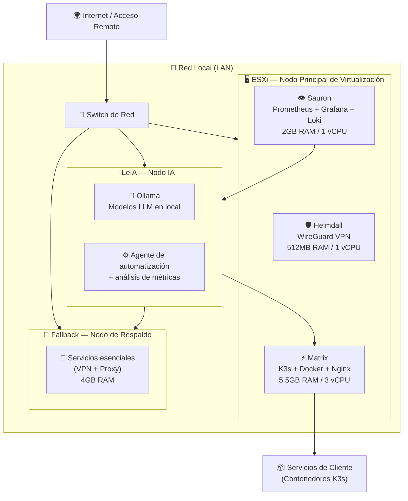
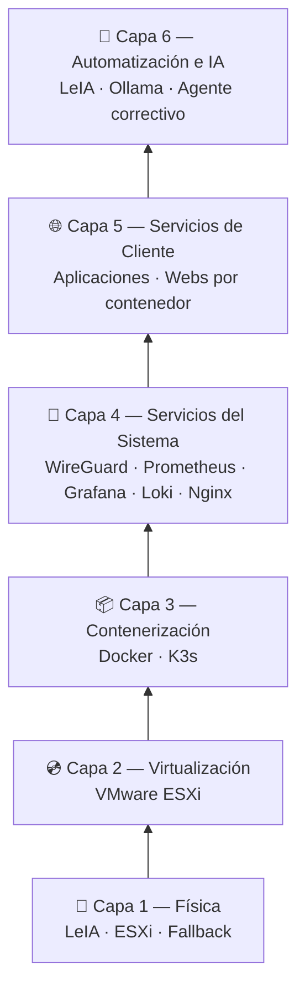
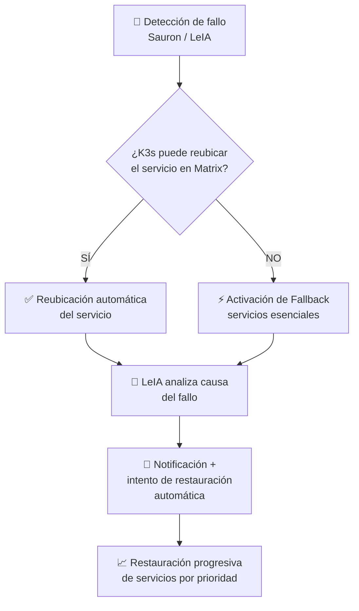

# 🏗️ Diseño del Proyecto — SaaSphere

> [!abstract]+ Resumen del documento
> Este documento recoge los requisitos del sistema, las decisiones de diseño justificadas y la arquitectura completa de **SaaSphere**: una plataforma de infraestructura distribuida, resiliente y aumentada con inteligencia artificial, desplegada sobre hardware doméstico.

---

## 1. 📋 Requisitos del Sistema

### 1.1 Requisitos Funcionales

> [!tip]+ ✅ Funcionales — Comportamiento esperado del sistema

| ID      | Requisito                                                            | Justificación                                                                          |
| ------- | -------------------------------------------------------------------- | -------------------------------------------------------------------------------------- |
| `RF-01` | Desplegar servicios de forma distribuida entre varios nodos          | Eliminar el punto único de fallo: si un nodo cae, el resto del sistema sigue operativo |
| `RF-02` | Ejecutar todos los servicios en contenedores Docker                  | Aislar cada servicio, facilitar su migración y reducir la superficie de ataque         |
| `RF-03` | Orquestar los contenedores mediante K3s                              | Controlar de forma centralizada el ciclo de vida de cada contenedor                    |
| `RF-04` | Centralizar los servicios principales en el nodo Matrix              | Aprovechar el nodo con más recursos como punto de ejecución principal                  |
| `RF-05` | Mantener un nodo de respaldo (Fallback) permanentemente disponible   | Garantizar la continuidad del servicio ante la caída de cualquier nodo principal       |
| `RF-06` | Soportar funcionamiento en modo degradado                            | Mantener activos únicamente los servicios esenciales ante pérdida de recursos          |
| `RF-07` | Priorizar servicios críticos ante situaciones de fallo               | Definir qué servicios deben sobrevivir ante una caída parcial                          |
| `RF-08` | Monitorizar el estado de toda la infraestructura en tiempo real      | Detectar anomalías antes de que se conviertan en incidencias graves                    |
| `RF-09` | Generar alertas automáticas ante umbrales críticos                   | Notificar de forma inmediata cuando alguna métrica supere los límites establecidos     |
| `RF-10` | Proporcionar acceso remoto seguro mediante VPN                       | Permitir la administración del sistema desde cualquier ubicación                       |
| `RF-11` | Analizar métricas e infraestructura mediante inteligencia artificial | Automatizar el análisis de logs y métricas, reduciendo la carga operativa              |
| `RF-12` | Capacidad de despliegue automático de servicios                      | Levantar servicios sin intervención manual, habilitando una operativa más eficiente    |
| `RF-13` | Permitir el reinicio automático de servicios o nodos ante fallos     | Reducir el tiempo de inactividad sin necesidad de intervención humana                  |

---

### 1.2 Requisitos No Funcionales

> [!example]+ ⚙️ No Funcionales — Calidad y restricciones de operación

| ID | Requisito | Métrica / Criterio de aceptación |
|---|---|---|
| `RNF-01` | Alta disponibilidad | El servicio debe mantenerse operativo ante la caída de un nodo completo |
| `RNF-02` | Resiliencia | Recuperación de errores de software, hardware o humanos sin pérdida permanente de datos |
| `RNF-03` | Escalabilidad horizontal | Añadir nuevos nodos o contenedores sin rediseñar la arquitectura |
| `RNF-04` | Modularidad | Cada servicio debe poder actualizarse o eliminarse sin afectar al resto |
| `RNF-05` | Portabilidad | Todos los servicios migrables a hardware diferente sin modificar su configuración interna |
| `RNF-06` | Eficiencia de recursos | Arquitectura funcional con el hardware disponible, sin infraestructura empresarial |
| `RNF-07` | Observabilidad completa | Todos los nodos y servicios exponen métricas accesibles desde Prometheus y Grafana |
| `RNF-08` | Separación de responsabilidades | Cada nodo tiene un rol definido y no asume funciones de otro salvo en fallo |
| `RNF-09` | Operabilidad | Operable con conocimiento estándar de Linux, Docker y K3s |

---

### 1.3 Restricciones del Proyecto

> [!warning]+ ⚠️ Restricciones — Condicionantes del entorno real

| ID | Restricción | Impacto en el diseño |
|---|---|---|
| `R-01` | Hardware doméstico y de gama media | Limita servicios simultáneos y tamaño de modelos de IA en local |
| `R-02` | Proyecto unipersonal | La arquitectura debe priorizar la automatización para compensar la falta de equipo |
| `R-03` | Presupuesto reducido | Se descartan soluciones cloud de pago; se opta por modelos locales con Ollama |
| `R-04` | GPU de gama media (RTX 3060 Ti) | Modelos de IA limitados en tamaño; se contempla uso de APIs externas como respaldo |
| `R-05` | Nodo Fallback con recursos muy limitados (4 GB RAM) | Solo puede asumir servicios esenciales en modo degradado |

---

## 2. 🧠 Decisiones de Diseño

> [!quote] Las decisiones técnicas no se toman en el vacío — cada elección tiene un coste y un beneficio que debe justificarse frente a sus alternativas.

### 2.1 K3s frente a Kubernetes completo

> [!info]+ ☸️ Por qué K3s

Kubernetes estándar requiere una cantidad mínima de recursos considerable y una complejidad operativa elevada para un entorno de un solo administrador. **K3s** es una distribución certificada de Kubernetes diseñada para entornos con recursos limitados, manteniendo la compatibilidad con todos los manifiestos y herramientas del ecosistema.

Dado el hardware disponible y el carácter unipersonal del proyecto, K3s ofrece la misma orquestación con una huella de recursos notablemente menor.

---

### 2.2 Ollama para IA local frente a API externa

> [!info]+ 🤖 Por qué Ollama

El uso de una API externa (OpenAI, Anthropic) implica dependencia de un tercero, coste por token y envío de datos potencialmente sensibles fuera de la infraestructura. **Ollama** permite ejecutar modelos de lenguaje en local sobre la GPU del nodo LeIA, manteniendo los datos dentro del entorno y eliminando el coste recurrente por inferencia.

La limitación es la capacidad del hardware, por lo que se contempla el uso de APIs externas como alternativa de respaldo para casos que superen las capacidades locales.

---

### 2.3 Prometheus + Grafana + Loki frente a soluciones todo-en-uno

> [!info]+ 📊 Por qué el stack OSS

Soluciones como Datadog o New Relic ofrecen observabilidad completa integrada, pero con un coste mensual inasumible en la fase inicial. El stack **Prometheus + Grafana + Loki** es el estándar de facto en entornos open source, con comunidad activa, amplia documentación y total compatibilidad con el ecosistema Kubernetes/Docker.

---

## 3. 🌐 Arquitectura del Sistema

### 3.1 Visión General

> [!abstract]+ Topología de la infraestructura SaaSphere

La arquitectura de SaaSphere se organiza en **tres nodos físicos** con roles claramente diferenciados, sobre los que se construyen capas de virtualización, contenerización y servicios. El objetivo es que ningún servicio crítico dependa de un único punto de fallo.

---

### 3.2 Nodos Físicos

#### 🤖 LeIA — Nodo de Inteligencia Artificial

> [!example]+ Especificaciones de LeIA

| Componente | Especificación |
|---|---|
| Tipo | PC de escritorio de alto rendimiento |
| Rol | Análisis, automatización e inteligencia artificial |
| RAM | 32 GB |
| Procesador | Intel Core i9-12900KF |
| GPU | NVIDIA RTX 3060 Ti |

> [!tip] Servicios que ejecuta
> - **Ollama** — servidor de modelos de lenguaje en local
> - **Scripts de análisis** de métricas e infraestructura
> - **Motor de automatización** y toma de decisiones
> - **Agente de respuesta** ante incidencias

> [!note] LeIA no participa en la ejecución directa de los servicios de cliente. Su función es **observar**, **detectar anomalías** y **ejecutar acciones correctivas** de forma autónoma. Es el elemento diferenciador de la arquitectura.

---

#### 🖥️ ESXi — Nodo Principal de Virtualización

> [!example]+ Especificaciones de ESXi

| Componente | Especificación |
|---|---|
| Tipo | Servidor físico con VMware ESXi |
| Rol | Nodo principal, aloja las VMs del proyecto |
| RAM disponible | 10 GB *(12 GB físicos, 2 GB reservados para el hipervisor)* |
| Procesador | 4× Intel Xeon E31220 @ 3.10 GHz |

> [!tip] Máquinas virtuales alojadas

| VM | SO | RAM | vCPU | Disco | Rol | Servicios |
|---|---|---|---|---|---|---|
| **Heimdall** | Debian (minimal) | 512 MB | 1 | 50 GB | Servidor VPN | WireGuard |
| **Sauron** | Debian Server | 2 GB | 1 | 100 GB | Monitorización | Prometheus, Grafana, Loki |
| **Matrix** | Debian Server | 5,5 GB | 3 | 500 GB | Nodo principal | K3s, Docker, Nginx |

---

#### 💾 Fallback — Nodo de Respaldo

> [!example]+ Especificaciones de Fallback

| Componente | Especificación |
|---|---|
| Tipo | Portátil reutilizado como miniservidor |
| Rol | Nodo de respaldo ante caídas del nodo ESXi |
| RAM | 4 GB |
| Procesador | Intel Pentium 2020M @ 2.40 GHz |

> [!warning] En condiciones normales, Fallback permanece en **espera sin ejecutar servicios de producción**. Su activación es automática ante la detección de caída de un nodo principal. Dadas sus limitaciones, únicamente asume los servicios **críticos**: VPN y proxy inverso como mínimo.

---

### 3.3 Estructura por Capas

> [!abstract]+ Modelo de capas funcionales

| Capa | Nombre | Descripción |
|---|---|---|
| **1** | Física | Hardware real: tres nodos conectados en red local mediante switch |
| **2** | Virtualización | ESXi abstrae el hardware y ejecuta múltiples VMs con recursos controlados |
| **3** | Contenerización | Docker y K3s en Matrix; cada servicio corre en su propio contenedor aislado |
| **4** | Servicios del sistema | WireGuard, Prometheus + Grafana + Loki, Nginx — servicios transversales de soporte |
| **5** | Servicios de cliente | Aplicaciones y webs por cliente, accesibles desde el exterior vía proxy inverso |
| **6** | Automatización e IA | LeIA consume métricas, analiza logs y ejecuta acciones correctivas de forma autónoma |

---

## 4. 🔄 Flujos de Funcionamiento

### 4.1 Funcionamiento Normal

> [!success]+ 🟢 Estado operativo nominal

En condiciones normales:

- El **tráfico externo** entra por el proxy inverso (Nginx en Matrix), que lo redirige al contenedor correspondiente según el dominio del cliente.
- **K3s** gestiona el ciclo de vida de todos los contenedores activos.
- **Sauron** recopila métricas de todos los nodos y servicios de forma continua. Grafana las visualiza y dispara alertas si algún umbral es superado.
- **Heimdall** mantiene activo el túnel WireGuard para acceso administrativo remoto en todo momento.
- **LeIA** analiza periódicamente el estado del sistema: revisa logs, detecta patrones anómalos y ejecuta acciones correctivas sin intervención humana.

---

### 4.2 Funcionamiento en Modo Degradado

> [!danger]+ 🔴 Flujo de respuesta ante fallo

---

### 4.3 Prioridad de Restauración de Servicios

> [!warning]+ 🔁 Orden de recuperación ante incidencias

| Prioridad | Servicio | Motivo |
|---|---|---|
| 🥇 **1** | WireGuard (VPN) | Sin acceso remoto no se puede intervenir manualmente |
| 🥈 **2** | Proxy inverso (Nginx) | Sin él, ningún cliente tiene acceso a su servicio |
| 🥉 **3** | Monitorización (Prometheus) | Necesaria para evaluar el estado durante la recuperación |
| **4** | Servicios de cliente | Restaurados por orden de criticidad del cliente |

> [!note] La restauración se realiza de forma **progresiva y no simultánea** para evitar sobrecargar el hardware y generar un segundo incidente durante la recuperación.

---

*#tfg #saasphere #arquitectura #k3s #docker #kubernetes #wireguard #observabilidad #ia #homelab*