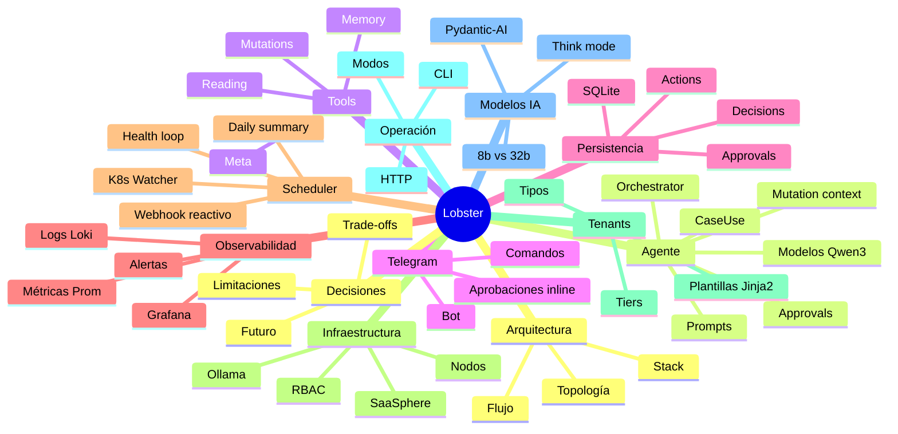

# 🧠 Lobster — Central de Conocimiento

> [!abstract] ¿Qué es esta wiki?
> Este vault es la **central de conocimiento** del proyecto **Lobster**: el agente IA de orquestación de infraestructura Kubernetes del homelab **SaaSphere**. Aquí se documenta absolutamente todo — arquitectura, código, modelos de IA, decisiones de diseño, operación diaria, limitaciones y futuro.
>
> La wiki convive con los documentos de fases del TFG (`TFG_Fase6_Lobster.md` … `TFG_Fase9_Lobster.md`) y con la carpeta `obsidian/YYYY-MM/` que el propio agente genera con sus resúmenes diarios. **No pisa nada existente.**

> [!tip] Cómo usar esta wiki
> - Cada nota está enlazada por wikilinks `[[ ]]` — abre el **grafo de Obsidian** para verlo entero.
> - Los `#headings` están preparados para enlace fino con `[[Nota#sección]]`.
> - Los callouts indican intención: `[!abstract]` resúmenes, `[!tip]` aprendizajes, `[!example]` comandos, `[!warning]` precauciones, `[!danger]` riesgos, `[!info]` datos puros, `[!note]` curiosidades.
> - Los diagramas Mermaid se renderizan nativamente en Obsidian.

---

## 🗺️ Mapa de áreas (MOC)

---

## 🌳 Árbol de carpetas

### 📐 [[01-Arquitectura/00-MOC-Arquitectura|01 · Arquitectura]]
Visión global, stack tecnológico, topología del homelab, flujo de datos y el modelo evolutivo por fases del TFG.

- [[01-Arquitectura/01-Vision-general|Visión general]]
- [[01-Arquitectura/02-Stack-tecnologico|Stack tecnológico]]
- [[01-Arquitectura/03-Topologia-homelab|Topología del homelab]]
- [[01-Arquitectura/04-Flujo-datos-y-control|Flujo de datos y control]]
- [[01-Arquitectura/05-Modelo-evolutivo-por-fases|Modelo evolutivo por fases]]

### 🤖 [[02-Agente/00-MOC-Agente|02 · Agente]]
El núcleo del proyecto: el `LobsterAgent`, los `CaseUse`, los modelos de Qwen3, el sistema de prompts, el `MutationContext` y el `ApprovalManager`.

- [[02-Agente/01-LobsterAgent-orchestrator|Orchestrator]]
- [[02-Agente/02-CaseUse-y-routing|CaseUse & routing]]
- [[02-Agente/03-Modelos-Qwen3|Modelos Qwen3]]
- [[02-Agente/04-System-prompts|System prompts]]
- [[02-Agente/05-Mutation-context|Mutation context]]
- [[02-Agente/06-Approval-manager|Approval manager]]
- [[02-Agente/07-Agent-state-modos|Agent state & modos]]

### 🛠️ [[03-Tools/00-MOC-Tools|03 · Tools]]
Las **30+ funciones** que el agente puede invocar. Lectura (Prometheus, Loki, K8s, Alertmanager, memoria) y mutaciones (pods, deployments, tenants, nodos).

- Lectura: [[03-Tools/01-Reading-Prometheus|Prometheus]] · [[03-Tools/02-Reading-Loki|Loki]] · [[03-Tools/03-Reading-K8s|K8s]] · [[03-Tools/04-Reading-Alertmanager|Alertmanager]] · [[03-Tools/05-Reading-Memory|Memory]]
- Mutaciones: [[03-Tools/06-Mutations-K8s|K8s pods/deployments]] · [[03-Tools/07-Mutations-Tenants|Tenants]] · [[03-Tools/08-Mutations-Nodes|Nodos]]
- Meta: [[03-Tools/09-Meta-request-new-tool|request_new_tool]] · [[03-Tools/10-Dummy-tools|Dummy]]

### 💬 [[04-Telegram/00-MOC-Telegram|04 · Telegram]]
El operador habla con Lobster por Telegram. Bot aiogram v3, comandos, aprobaciones inline, memoria conversacional y formateo MarkdownV2.

- [[04-Telegram/01-Bot-runner|Bot runner]]
- [[04-Telegram/02-Handlers-comandos|Handlers & comandos]]
- [[04-Telegram/03-Aprobaciones-inline|Aprobaciones inline]]
- [[04-Telegram/04-Conversation-memory|Conversation memory]]
- [[04-Telegram/05-Formatting-MarkdownV2|Formatting MarkdownV2]]
- [[04-Telegram/06-Notifier|Notifier]]

### 💾 [[05-Persistencia/00-MOC-Persistencia|05 · Persistencia]]
SQLite + SQLModel + aiosqlite. Esquema, repositorios, máquinas de estado (Action, Approval) y migraciones Alembic.

- [[05-Persistencia/01-SQLite-esquema|Esquema SQLite]]
- [[05-Persistencia/02-Decisions|Decisions]]
- [[05-Persistencia/03-Actions-ledger|Actions ledger]]
- [[05-Persistencia/04-Approvals|Approvals]]
- [[05-Persistencia/05-Tool-requests|Tool requests]]
- [[05-Persistencia/06-Conversation-turns|Conversation turns]]
- [[05-Persistencia/07-Agent-state|Agent state]]
- [[05-Persistencia/08-Events-Tenant-state-Snapshots|Otras tablas]]
- [[05-Persistencia/09-Alembic-migraciones|Alembic migraciones]]

### 📊 [[06-Observabilidad/00-MOC-Observabilidad|06 · Observabilidad]]
Logs structlog → Loki, métricas Prometheus, dashboard Grafana, alertas Prometheus y webhook reactivo de Alertmanager.

- [[06-Observabilidad/01-Logs-structlog-Loki|Logs]]
- [[06-Observabilidad/02-Metricas-Prometheus|Métricas]]
- [[06-Observabilidad/03-Dashboard-Grafana|Dashboard]]
- [[06-Observabilidad/04-Alertas-Prometheus|Alertas]]
- [[06-Observabilidad/05-Webhook-Alertmanager|Webhook]]

### ⏰ [[07-Scheduler-Watcher/00-MOC-Scheduler|07 · Scheduler y Watcher]]
APScheduler con 7 jobs autónomos + K8s Watcher en streaming + cola FIFO (Fase 9) que serializa los jobs LLM-pesados.

- [[07-Scheduler-Watcher/01-APScheduler-jobs|APScheduler jobs]]
- [[07-Scheduler-Watcher/02-Health-loop|Health loop]]
- [[07-Scheduler-Watcher/03-Global-state-Summary-Daily|Global state, hourly & daily]]
- [[07-Scheduler-Watcher/04-Backup-Optimization|Backup & optimization]]
- [[07-Scheduler-Watcher/05-Alert-reactive|Alert reactive]]
- [[07-Scheduler-Watcher/06-K8s-Watcher|K8s Watcher streaming]]
- [[07-Scheduler-Watcher/07-Job-queue-fase9|Job queue (Fase 9)]]

### 🖧 [[08-Infraestructura/00-MOC-Infraestructura|08 · Infraestructura]]
SaaSphere = K3s (matrix + fallback). Sauron monitoriza. LeIA hospeda Lobster + Ollama (GPU). Heimdall es proxy/edge.

- [[08-Infraestructura/01-SaaSphere-cluster-K3s|Cluster K3s]]
- [[08-Infraestructura/02-Nodos-matrix-fallback|Nodos matrix & fallback]]
- [[08-Infraestructura/03-Hosts-LeIA-Sauron-Heimdall|Hosts auxiliares]]
- [[08-Infraestructura/04-Ollama-GPU|Ollama y GPU]]
- [[08-Infraestructura/05-RBAC-Kubeconfig|RBAC & kubeconfig]]
- [[08-Infraestructura/06-Systemd-deploy|Systemd y despliegue]]

### 🏢 [[09-Tenants/00-MOC-Tenants|09 · Tenants]]
Modelo multi-tenant: tiers FREE/BASIC/PREMIUM, tipos WordPress/Static/WebApp, plantillas Jinja2, ciclo de vida.

- [[09-Tenants/01-Modelo-multi-tenant|Modelo]]
- [[09-Tenants/02-Tiers|Tiers]]
- [[09-Tenants/03-Tipos|Tipos]]
- [[09-Tenants/04-Plantillas-Jinja2|Plantillas]]
- [[09-Tenants/05-Ciclo-de-vida|Ciclo de vida]]
- [[09-Tenants/06-Politica-namespaces|Política]]

### 🧑‍✈️ [[10-Operacion/00-MOC-Operacion|10 · Operación]]
Cómo se opera Lobster en el día a día: CLI, HTTP, comandos Telegram, modos del agente, troubleshooting.

- [[10-Operacion/01-Comandos-CLI|CLI]]
- [[10-Operacion/02-Comandos-Telegram|Telegram]]
- [[10-Operacion/03-Endpoints-HTTP|HTTP]]
- [[10-Operacion/04-Modos-normal-dryrun-paused|Modos]]
- [[10-Operacion/05-Flujo-aprobacion-humano|Aprobación humana]]
- [[10-Operacion/06-Daily-summary-Obsidian|Daily summary]]
- [[10-Operacion/07-Troubleshooting|Troubleshooting]]

### 🧬 [[11-Modelos-IA/00-MOC-Modelos|11 · Modelos IA]]
Qwen3 (8b y 32b), think mode, Pydantic-AI, tool calling, timeouts, limitaciones y mitigaciones.

- [[11-Modelos-IA/01-Qwen3-overview|Qwen3]]
- [[11-Modelos-IA/02-8b-vs-32b|8b vs 32b]]
- [[11-Modelos-IA/03-Think-mode|Think mode]]
- [[11-Modelos-IA/04-Pydantic-AI|Pydantic-AI]]
- [[11-Modelos-IA/05-Tool-calling|Tool calling]]
- [[11-Modelos-IA/06-Timeouts-y-cola|Timeouts y cola]]
- [[11-Modelos-IA/07-Limitaciones-y-mitigaciones|Limitaciones]]

### 🧭 [[12-Decisiones-Limitaciones/00-MOC-Decisiones|12 · Decisiones y limitaciones]]
Capítulos académicos: decisiones arquitectónicas, trade-offs, riesgos, roadmap y mapa al TFG.

- [[12-Decisiones-Limitaciones/01-Decisiones-arquitectura|Decisiones]]
- [[12-Decisiones-Limitaciones/02-Limitaciones-actuales|Limitaciones]]
- [[12-Decisiones-Limitaciones/03-Trade-offs|Trade-offs]]
- [[12-Decisiones-Limitaciones/04-Riesgos|Riesgos]]
- [[12-Decisiones-Limitaciones/05-Futuro-roadmap|Roadmap]]
- [[12-Decisiones-Limitaciones/06-Mapa-al-TFG|Mapa al TFG]]

### 📚 [[13-Glosario-Referencias/00-MOC-Glosario|13 · Glosario y referencias]]

- [[13-Glosario-Referencias/01-Glosario|Glosario]]
- [[13-Glosario-Referencias/02-Cheatsheet-comandos|Cheatsheet]]
- [[13-Glosario-Referencias/03-Referencias-externas|Referencias externas]]
- [[13-Glosario-Referencias/04-Fases-existentes|Mapa a fases existentes]]

### 🛠️ [[14-Mejoras/00-MOC-Mejoras|14 · Mejoras]] *(añadido tras leer el PDF del TFG)*
Brechas detectadas entre la wiki y la memoria TFG, mejoras técnicas, de negocio y de documentación, con roadmap priorizado.

- [[14-Mejoras/01-Brechas-detectadas-PDF|Brechas wiki vs PDF]] ⚠️ **leer primero**
- [[14-Mejoras/02-Mejoras-tecnicas|Mejoras técnicas]]
- [[14-Mejoras/03-Mejoras-negocio-y-producto|Negocio y producto]]
- [[14-Mejoras/04-Mejoras-documentacion-TFG|Documentación TFG]]
- [[14-Mejoras/05-Roadmap-priorizado|Roadmap priorizado]]

---

## 🚦 Estado del proyecto

> [!info] Versión actual
> - **Código**: `lobster` 0.1.0 · Python 3.13 · uv como gestor.
> - **Fases TFG**: del 1 al 9 (Fase 6 = scheduler + K8s watcher + webhook · Fase 7 = observabilidad · Fase 8 = pin/unpin · Fase 9 = cola FIFO).
> - **Estado operativo**: en producción en homelab SaaSphere. Modo por defecto `normal` (mutaciones reales).
> - **Operador**: Angel, vía Telegram + CLI desde LeIA.

> [!success] Capacidades clave
> ✅ Monitoriza el clúster cada 5 min sin intervención humana.
> ✅ Reacciona en tiempo real a eventos K8s críticos (CrashLoopBackOff, OOMKilled, …).
> ✅ Recibe webhooks de Alertmanager y actúa autónomamente.
> ✅ Despliega tenants completos (WordPress, sitios estáticos, web apps) desde un único comando.
> ✅ Migra workloads entre nodos cuando matrix se satura (pin/unpin).
> ✅ Pide aprobación por Telegram con botón inline antes de cualquier mutación NORMAL/CRITICAL.
> ✅ Genera resumen operativo diario en este mismo vault.

> [!warning] Limitaciones conocidas
> ⚠️ Solo opera sobre **un clúster** y dos nodos (matrix + fallback).
> ⚠️ Depende de **Ollama local**; sin GPU, qwen3:32b es lento (~10 min/daily_summary).
> ⚠️ El modo **think** es inestable para tool calling — se desactiva en jobs críticos.
> ⚠️ Sin trazabilidad cross-decision (cada decisión es independiente).
> ⚠️ La cola FIFO no tiene priorización: si entra un daily_summary antes que un alert_reactive, este espera.

→ Ver [[12-Decisiones-Limitaciones/02-Limitaciones-actuales|Limitaciones]] para el análisis completo.

---

## 🔗 Documentos del TFG existentes (no tocados)

Estos archivos viven en `obsidian/` y son las fases académicas escritas por el autor. Esta wiki los referencia pero no los modifica:

- `obsidian/TFG_Fase6_Lobster.md` — Scheduler + K8s Watcher + Webhook.
- `obsidian/TFG_Fase7_Lobster.md` — Observabilidad (Loki, Prometheus, Grafana).
- `obsidian/TFG_Fase8_Lobster.md` — Pin/unpin entre nodos.
- `obsidian/TFG_Fase9_Lobster.md` — Cola FIFO de jobs LLM.
- Carpeta `obsidian/YYYY-MM/` → resúmenes diarios generados por `daily_summary`.

→ Ver [[13-Glosario-Referencias/04-Fases-existentes|Mapa a fases existentes]].

---

## 🚀 Atajos útiles

| Tarea | Atajo |
|---|---|
| Ver decisiones recientes | `uv run lobster decisions list` |
| Ver ledger de mutaciones | `uv run lobster actions list` |
| Ver aprobaciones pendientes | `uv run lobster approvals list --status pending` |
| Cambiar modo | `uv run lobster state set normal\|dry_run\|paused` |
| Hacer una pregunta | `uv run lobster ask "..."` |
| Listar tenants | `uv run lobster tenants list` |
| Forzar un job | `curl -X POST http://localhost:8080/admin/trigger/health_loop` |
| Salud HTTP | `curl http://localhost:8080/health` |
| Métricas Prom | `curl http://localhost:8080/metrics` |

→ Cheatsheet completo en [[13-Glosario-Referencias/02-Cheatsheet-comandos]].

---

> [!note] Autoría
> Wiki generada automáticamente para el proyecto Lobster del TFG de Angel. Última actualización: 2026-05-16.
