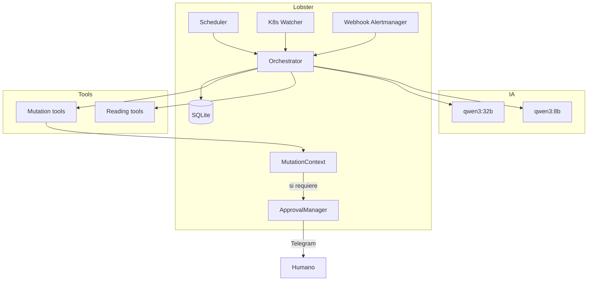

# 🌅 Visión general

> [!abstract] Una frase
> Lobster es un **agente IA autónomo** que monitoriza, diagnostica y opera un clúster Kubernetes (K3s) **sin intervención humana** salvo para acciones críticas, comunicándose con el operador por **Telegram** y razonando con **LLMs locales** (Qwen3 sobre Ollama).

## 🎯 Problema que resuelve

Un homelab pequeño con tenants reales (sitios web, WordPress, apps) sufre los mismos problemas que producción — *pods que crashean, nodos saturados, alertas inesperadas* — pero **no tiene equipo SRE de guardia**. La opción típica es:

1. **Configurar alertas y reaccionar manualmente** → no escala, exige despertarse de noche.
2. **Automatizar todo con scripts** → frágil, no entiende contexto, no explica.
3. **Pagar un PaaS** → caro, contrario al espíritu del homelab.

Lobster es la opción 4: **un agente LLM-driven que razona, llama tools, actúa con políticas y pide aprobación cuando duda.**

## 🧩 Componentes principales

## 🧠 Filosofía operativa

> [!tip] Cinco principios
> 1. **Si dudas, no actúes** → pregunta al humano.
> 2. **Verifica antes de mutar** → llama `list_pods` / `get_pod` para confirmar que el recurso existe.
> 3. **Toda mutación queda en el ledger** → auditable después.
> 4. **Aprobación humana para todo lo NORMAL o CRITICAL** → bloqueo asíncrono real (`wait_for_decision`).
> 5. **Read-only por defecto** → la mayoría de los `CaseUse` no tienen tools de mutación registradas.

## 🔄 Bucle agéntico en una frase

> *Lee → razona → decide tool calls → valida policy → pide aprobación si hace falta → ejecuta → registra → emite mensaje a Telegram → vuelve a leer.*

→ Diagrama completo en [[04-Flujo-datos-y-control]].

## 🧪 Modos de uso

Lobster expone su funcionalidad por **tres superficies**:

| Superficie | Quién la usa | Para qué |
|---|---|---|
| **CLI** (`uv run lobster …`) | Operador en LeIA por SSH | Inspeccionar SQLite, cambiar modo, lanzar tenants |
| **HTTP** (`http://localhost:8080`) | Otros sistemas (Alertmanager, scripts) | `/webhook/alert`, `/admin/trigger` |
| **Telegram** | Operador en cualquier lugar | Interacción natural, aprobaciones |

→ Ver [[../10-Operacion/00-MOC-Operacion|MOC Operación]].

## 🚏 Estados internos

Solo hay **tres modos globales** del agente, en `AgentState.mode`:

- 🟢 **normal** — comportamiento estándar, mutaciones reales tras aprobación.
- 🟡 **dry_run** — todas las aprobaciones se auto-aprueban con `dry_run_auto_approved` pero los executors no llegan a tocar K8s; se marca `ABORTED_DRY_RUN`.
- 🔴 **paused** — el LLM no se ejecuta. `LobsterAgent.run()` devuelve `outcome="skipped_paused"` sin llamar a Ollama.

→ Detalles en [[../02-Agente/07-Agent-state-modos]].

## 🚀 Camino del request

> [!example] Ejemplo: un health_loop_read encuentra un pod en CrashLoop
> 1. APScheduler dispara `health_loop_job` (cada 5 min).
> 2. `LobsterAgent.run(CaseUse.HEALTH_LOOP_READ, prompt)`.
> 3. Pydantic-AI llama `list_pods`, `get_node_health('matrix')`, `list_deployments`.
> 4. El LLM responde con `[ANOMALÍA] Pod foo-7df4 en CrashLoopBackOff…`.
> 5. El scheduler detecta `[ANOMALÍA]` y encadena `HEALTH_LOOP_ANALYZE`.
> 6. El agente confirma con `get_pod`, lee logs con `get_pod_logs`.
> 7. Como el pod sí está en CrashLoop y está en un namespace tenant → severidad `AUTONOMOUS`.
> 8. `restart_pod` se ejecuta sin pedir aprobación, queda en `actions` como `COMPLETED`.
> 9. Mensaje a Telegram: *"🔍 Lobster [health_loop_analyze]: reinicié foo-7df4."*

## 📚 Lecturas complementarias

- [[02-Stack-tecnologico]] — qué librerías.
- [[03-Topologia-homelab]] — dónde corre cada cosa.
- [[../02-Agente/01-LobsterAgent-orchestrator]] — cómo se programa internamente el bucle.
- [[../12-Decisiones-Limitaciones/01-Decisiones-arquitectura]] — por qué Pydantic-AI, por qué SQLite, por qué Ollama local.
