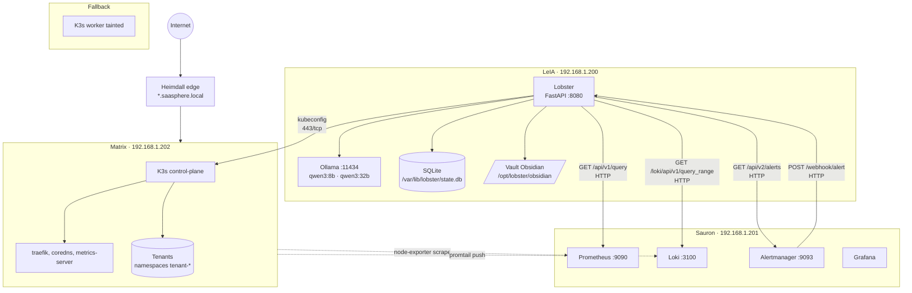

# 🖧 Topología del homelab SaaSphere

> [!abstract] La cara física del proyecto
> SaaSphere se reparte sobre 5 hosts físicos/virtuales. Dos son **nodos K3s** (matrix + fallback). Los otros tres son **infra externa** (LeIA = agente + IA, Sauron = observabilidad, Heimdall = edge).

## 🧭 Hosts y roles

| Host | IP | Rol | Servicios principales |
|---|---|---|---|
| **LeIA** | `192.168.1.200` | Cerebro IA | Lobster (FastAPI :8080), Ollama (:11434) |
| **Sauron** | `192.168.1.201` | Observabilidad | Prometheus :9090, Alertmanager :9093, Loki :3100, Grafana |
| **Matrix** | `192.168.1.202` | Clúster K3s | control-plane + workloads de tenants |
| **Fallback** | (local) | K3s standby | worker tainted `saasphere/role=fallback:NoSchedule` |
| **Heimdall** | (edge) | Proxy / DNS | Traefik / `*.saasphere.local` |

## 🗺️ Diagrama lógico

## 🛡️ Política K8s por nodo

> [!info] Política de pinning
> El nodo **fallback** lleva el taint `saasphere/role=fallback:NoSchedule`. Los pods NO se planifican ahí salvo que se haga `pin_deployment_to_node('fallback')`. Cuando matrix se recupera, `unpin_deployment_from_node` libera el deployment para que K8s vuelva a programarlo donde quiera.

> [!warning] Hosts que NO son nodos K3s
> Los hosts `leia`, `sauron` y `heimdall` aparecen en métricas de Prometheus como **targets externos** (node-exporter). **No son nodos del clúster**. Si pides al agente que "muévalo a sauron" se negará: solo `matrix` y `fallback` son schedulables.

## 🔐 Acceso desde LeIA al clúster

- `K8sConfig.kubeconfig_path = "/etc/lobster/kubeconfig"` (default).
- Es un kubeconfig **read-only por defecto** + verbos extra de patch para los recursos permitidos (Deployments, ConfigMaps, etc.).
- Se genera con `deploy/k8s/generate-kubeconfig.sh` ejecutado en matrix → `scp` a leia.
- → Ver [[../08-Infraestructura/05-RBAC-Kubeconfig]] para el detalle.

## 📍 Por qué esta distribución

> [!tip] Razones operativas
> - **GPU en LeIA, no en matrix** → matrix necesita CPU libre para tenants; la inferencia LLM va donde está la VRAM.
> - **Observabilidad fuera del nodo monitorizado** → si matrix cae, Sauron sigue viendo y alertando.
> - **Edge separado** → certificados Let's Encrypt y DNS no se mezclan con K3s.
> - **SQLite local en LeIA, no en K8s** → el agente debe sobrevivir a una caída del clúster que está monitorizando.

→ Ver también [[../08-Infraestructura/03-Hosts-LeIA-Sauron-Heimdall]] para detalles por host.
