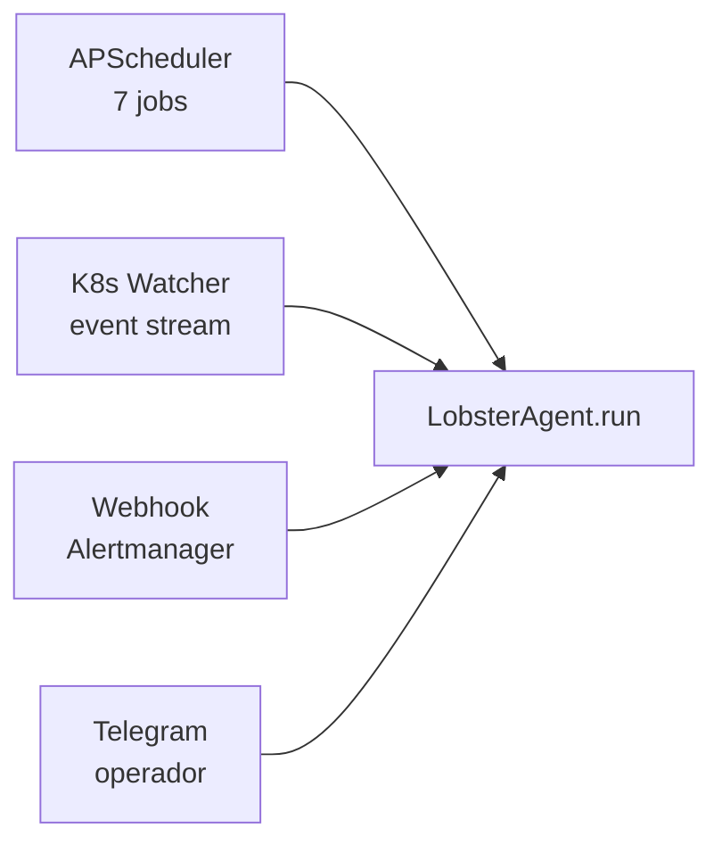
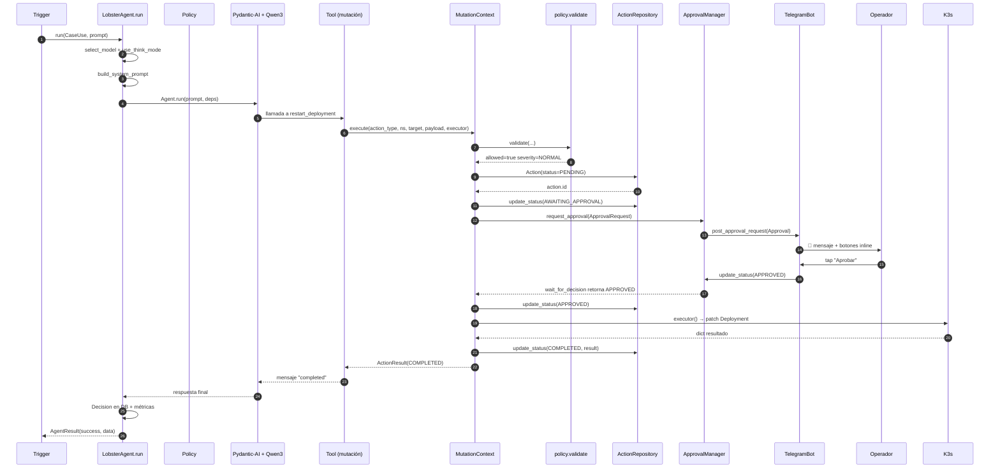
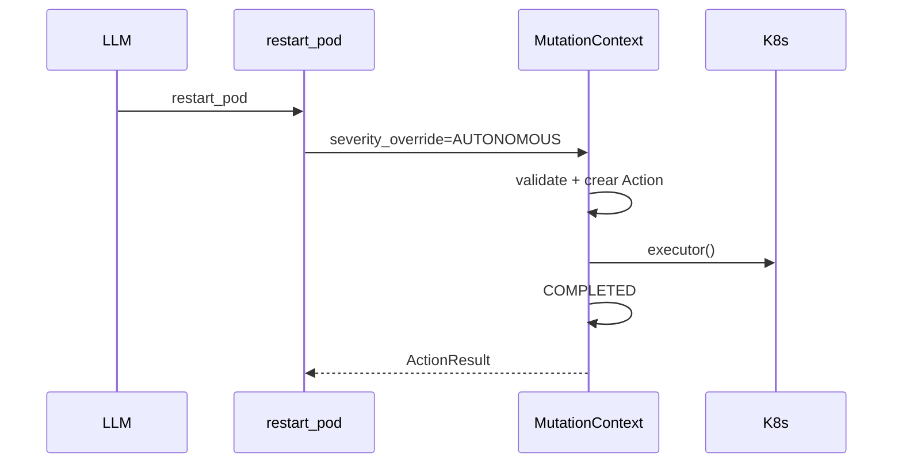
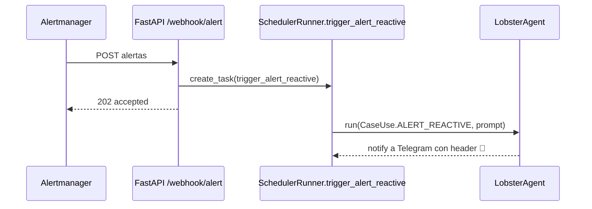
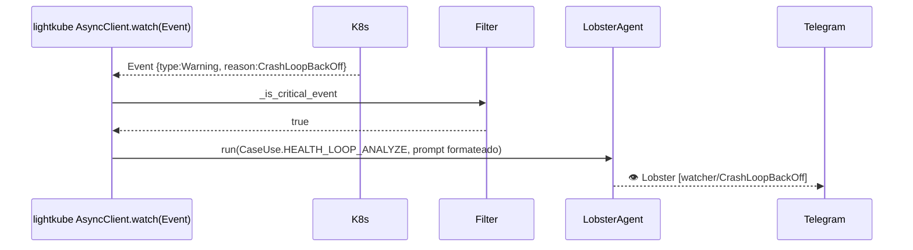

# 🔄 Flujo de datos y control

> [!abstract] El bucle completo
> Esta nota documenta los tres caminos por los que Lobster entra en acción y cómo termina cada uno.

## 🛣️ Tres disparadores

## 🎬 Secuencia detallada (con mutación que requiere aprobación)

## ⚡ Variante: acción AUTONOMOUS

Cuando el agente decide `restart_pod` y el pod está confirmado en `CrashLoopBackOff` **en un namespace tenant**, la severidad se convierte a `AUTONOMOUS` (lo decide `tools/mutations/k8s.py:restart_pod`). Eso salta los pasos 9-15:

## 📨 Variante: webhook reactivo

## 👀 Variante: K8s Watcher

## 🧬 Persistencia transversal

> [!info] Todo queda escrito
> En cualquiera de las variantes:
> - `decisions` ← una fila por `run()` con tokens, modelo, latencia, tools llamadas.
> - `actions` ← una fila por mutación, con su máquina de estados.
> - `approvals` ← una fila por petición de aprobación (si la había).
> - `tool_requests` ← una fila si el agente llamó `request_new_tool` por no encontrar herramienta.
> - Métricas Prom ← incrementadas (decisions_total, llm_latency, errors_total…).
> - Logs structlog ← evento JSON enviado a Loki en background.

→ Continúa en [[../05-Persistencia/01-SQLite-esquema]].
