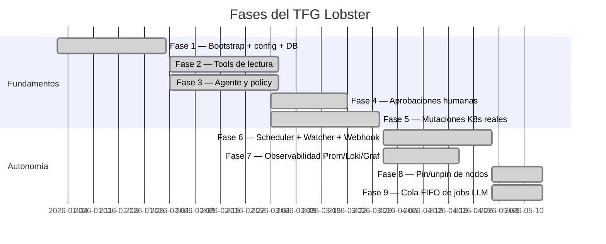

# 📜 Modelo evolutivo por fases del TFG

> [!abstract] El proyecto crece por fases académicas
> Lobster se desarrolló como **secuencia de fases** que añaden capacidades. Cada fase deja documentación en `obsidian/TFG_FaseN_Lobster.md`. Esta nota es el mapa-resumen de qué aporta cada una.

## 🧭 Línea temporal

## 📚 Fase por fase

### Fase 1 — Bootstrap

> [!info] Qué aporta
> - Proyecto `uv`, `pyproject.toml`, Python 3.13.
> - `Settings` con TOML + env.
> - FastAPI con `/health`.
> - `Decision` modelo y `DecisionRepository`.
> - Tests de health endpoint.

### Fase 2 — Tools de lectura

> [!info] Qué aporta
> - Clientes async `PrometheusClient`, `LokiClient`.
> - `K8sClient` (lightkube) con `list_pods`, `list_deployments`, etc.
> - `AlertmanagerClient` para alertas activas.
> - Las primeras tools registradas: `query_prometheus`, `list_pods`, `list_active_alerts`…
> - Modelos `domain/models.py` (PodInfo, NodeMetrics, …).

### Fase 3 — Agente y policy

> [!info] Qué aporta
> - `LobsterAgent` con Pydantic-AI.
> - `CaseUse` y `select_model` / `use_think_mode`.
> - `policy.validate()` con allowlist de namespaces y kinds prohibidos.
> - `ActionSeverity` y `ACTION_SEVERITIES`.
> - `MutationContext` (sin approvals todavía).

→ Documentado en `docs/fase_3_cierre_validacion.md`.

### Fase 4 — Aprobaciones humanas

> [!info] Qué aporta
> - `Approval`, `ApprovalStatus`, `ApprovalSeverity` en SQLite.
> - `ApprovalManager.request_approval()` + `wait_for_decision()`.
> - Bot Telegram (aiogram v3) y `TelegramBotRunner`.
> - Handlers `/status`, `/pending`, `/pause`, `/resume`, `/kill`.
> - Keyboard inline con botones Aprobar / Rechazar.
> - `ApprovalMaintenanceLoop` para expirar y recordar.

→ Documentado en `docs/fase_4_aprobaciones.md` y `docs/fase_4_resumen_implementacion.md`.

### Fase 5 — Mutaciones K8s reales

> [!info] Qué aporta
> - Tools `restart_pod`, `restart_deployment`, `scale_deployment`, `delete_pod_persistent`, `apply_manifest`, `update_configmap`.
> - Tools de tenant: `deploy_tenant`, `delete_tenant`, `pause_tenant`, `resume_tenant`, `verify_tenant_health`.
> - Plantillas Jinja2 (`wordpress.yaml.j2`, `static_site.yaml.j2`, `web_app.yaml.j2`).
> - Detección autónoma de CrashLoopBackOff para `restart_pod`.

### Fase 6 — Scheduler + K8s Watcher + Webhook

> [!info] Qué aporta
> - `SchedulerRunner` con APScheduler (7 jobs).
> - `K8sWatcher` con `lightkube.AsyncClient.watch(Event)`.
> - `POST /webhook/alert` que enruta a `ALERT_REACTIVE`.
> - Reglas de prefijo `[OK]` / `[ANOMALÍA]` para health_loop.
> - Encadenamiento read → analyze.
> - Guardado de daily_summary en `obsidian/YYYY-MM/`.

→ Documentado en `obsidian/TFG_Fase6_Lobster.md`.

### Fase 7 — Observabilidad

> [!info] Qué aporta
> - 10+ métricas Prometheus instrumentadas.
> - Logs `structlog` con push a Loki.
> - Dashboard Grafana exportable en `deploy/grafana/lobster-dashboard.json`.
> - 5 reglas de alerta Prometheus en `deploy/prometheus/lobster.rules.yaml`.
> - Loki queue con flush en background.

→ Documentado en `docs/fase_7_*.md` y `obsidian/TFG_Fase7_Lobster.md`.

### Fase 8 — Pin/unpin de nodos

> [!info] Qué aporta
> - Tools `pin_deployment_to_node` y `unpin_deployment_from_node`.
> - Lectura/escritura de `nodeSelector` y `tolerations` (lightkube patches).
> - Lógica de "matrix bajo presión" en `health_loop_read`.
> - Política `unpin` estable: matrix debe estar bajo umbral durante ≥ 15 min antes de soltar el pin.
> - Auto-tolerations: lee taints del nodo destino y genera tolerations.

→ Documentado en `obsidian/TFG_Fase8_Lobster.md`.

### Fase 9 — Cola FIFO de jobs LLM

> [!info] Qué aporta
> - `JobQueue` con `asyncio.Queue(maxsize=20)` y un único worker.
> - Solo `health_loop_read` corre directo; el resto va a la cola.
> - Métricas `lobster_queue_wait_seconds`, `lobster_queue_pending`, …
> - Comandos `/queue` en Telegram y `lobster queue list` en CLI.

→ Documentado en `obsidian/TFG_Fase9_Lobster.md`.

## 🗺️ Mapa al código

| Capacidad | Fase | Archivos clave |
|---|---|---|
| Config + bootstrap | 1 | `config.py`, `main.py` |
| Lectura externa | 2 | `clients/*`, `tools/reading.py` |
| Agente LLM | 3 | `agent/orchestrator.py`, `agent/routing.py`, `domain/policy.py` |
| Aprobación humana | 4 | `agent/approvals.py`, `telegram/*` |
| Mutaciones K8s | 5 | `agent/tools/mutations/*`, `manifests/*.j2` |
| Autonomía | 6 | `scheduler.py`, `k8s_watcher.py`, `/webhook/alert` |
| Observabilidad | 7 | `observability/*`, `deploy/grafana/`, `deploy/prometheus/` |
| Multinodo | 8 | `tools/mutations/node.py` |
| Cola | 9 | `job_queue.py` |
