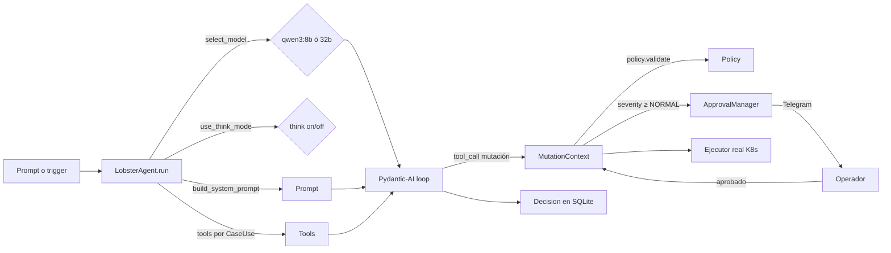

# 🤖 02 · Agente — MOC

> [!abstract] Núcleo de Lobster
> Toda la lógica de razonamiento vive aquí: cómo se construye el agente, cómo se eligen modelo y think mode según el caso de uso, cómo se ensambla el system prompt, cómo se intercepta una mutación para validarla, y cómo se bloquea el agente esperando una aprobación humana.

## Notas

- [[01-LobsterAgent-orchestrator]] — la clase principal, ciclo `run()`.
- [[02-CaseUse-y-routing]] — los 14 modos del agente.
- [[03-Modelos-Qwen3]] — selección 8b/32b y think mode.
- [[04-System-prompts]] — cómo se construyen los prompts por modo.
- [[05-Mutation-context]] — sobre policy → severity → approval → ledger → executor.
- [[06-Approval-manager]] — bloqueo asíncrono esperando al humano.
- [[07-Agent-state-modos]] — normal · dry_run · paused.

## Diagrama mental

## Enlaces cruzados

- Las herramientas que el agente puede llamar → [[../03-Tools/00-MOC-Tools|Tools]].
- La aprobación pasa por Telegram → [[../04-Telegram/03-Aprobaciones-inline|Aprobaciones inline]].
- Cada decisión se persiste → [[../05-Persistencia/02-Decisions|Decisions]].
- Cada mutación queda registrada → [[../05-Persistencia/03-Actions-ledger|Actions ledger]].
