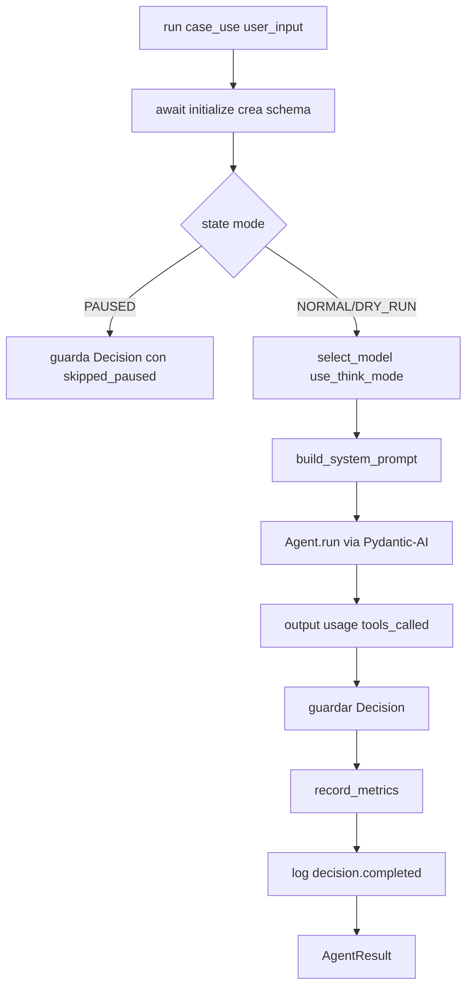
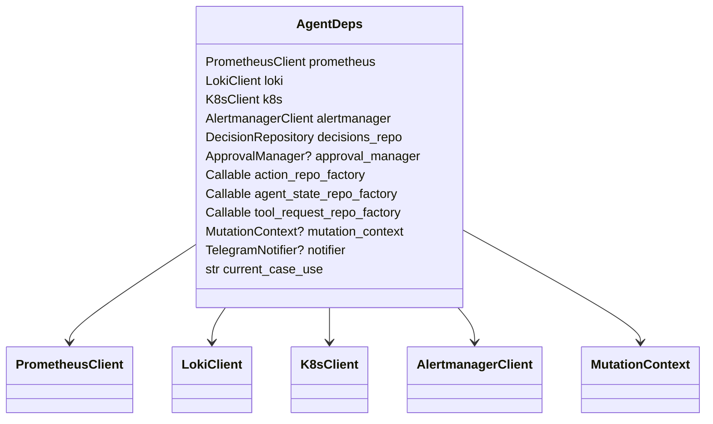

# 🧠 `LobsterAgent` — el orquestador

> [!abstract] Punto de entrada único
> Archivo: `lobster_agent/agent/orchestrator.py`. Todo lo que dispara una inferencia LLM pasa por `LobsterAgent.run(case_use, user_input, ...)`. La clase oculta detrás: selección de modelo y think mode, construcción del system prompt, registro del agente Pydantic-AI con sus tools, persistencia de la `Decision` resultante y emisión de métricas.

## 🧬 Estructura interna

```python
class LobsterAgent:
    def __init__(self, settings, deps, model_factory=None, no_tools=False):
        ...
        self._agents: dict[tuple[str, str, bool], Agent[AgentDeps, str]] = {}
        # cache: (case_use, model_name, think) → Agent ya construido
```

- **Cache de agentes**: cada combinación `(CaseUse, modelo, think)` se construye una vez y se reutiliza. Para 14 casos × 2 modelos × 2 think = potencialmente 56 agentes pero en la práctica son ~14 (el routing es determinista).
- **`MutationContext` lazy**: si `deps.mutation_context` viene a `None` pero hay `action_repo_factory`, se construye al instanciar el agente.
- **`_engine` propio**: el agente abre su propia conexión SQLite para escribir la `Decision` final, **independiente** de la sesión que comparten los repos del lifespan. Esto evita bloqueos al persistir mientras un job de larga duración tiene la sesión principal ocupada.

## 🔁 Ciclo `run()`



## 🛡️ Cortocircuito: modo `paused`

> [!warning] Si `AgentState.mode == PAUSED` el LLM NO se invoca
> ```python
> if state.mode == AgentMode.PAUSED:
>     decision = Decision(..., conclusion="Agent paused; LLM cycle skipped.")
>     return AgentResult(outcome="skipped_paused", ...)
> ```
> La persistencia y métrica siguen ocurriendo. El operador puede entrar en `paused` con `/kill` desde Telegram o `lobster state set paused`.

## 🎛️ Construcción del modelo (`_build_model`)

> [!info] Timeouts dinámicos
> ```python
> if think:
>     timeout = httpx.Timeout(None, connect=30.0)      # sin read timeout
> elif "32b" in model_name:
>     timeout = max(settings.ollama.timeout_seconds, 900.0)
> else:
>     timeout = settings.ollama.timeout_seconds        # 180 s default
> ```
> Esto está en `orchestrator.py:_build_model`. La razón es que:
> - `qwen3:32b` sin think puede tardar 5-10 min en una `daily_summary`.
> - Con think activo (modo `/think` de Qwen3) puede streamear razonamiento durante 10+ min.
> - Modelos 8b respetan el default razonable (180 s).

→ Detalles en [[../11-Modelos-IA/06-Timeouts-y-cola]].

## 🧩 `AgentResult`

```python
@dataclass(frozen=True)
class AgentResult:
    decision_id: UUID
    outcome: str        # "success" | "failed" | "skipped_paused"
    data: str | None
    error: str | None
```

Toda función que ejecute al agente (scheduler, watcher, CLI, telegram) consume estos resultados. El `outcome` también se usa para incrementar `lobster_decisions_total{outcome=…}` y `lobster_scheduler_runs_total{outcome=…}`.

## 🛠️ Selección de tools por CaseUse (`_build_tools_for_case`)

> [!example] No todas las tools en todos los modos
> El sistema deliberadamente **no expone todas las tools a todos los `CaseUse`**. Por ejemplo:
> - `SUMMARY` solo tiene `memory + list_active_alerts`.
> - `BACKUP` no puede ejecutar mutaciones.
> - `HEALTH_LOOP_READ` no tiene mutation_tools (lectura solo).
> - `HEALTH_LOOP_ANALYZE` sí las tiene (es la fase que actúa).
> - `CONVERSATION/CHAT/THINK/DIAGNOSE` reciben *todo* (el operador necesita verlo todo).
> - `SMOKE_TEST` o `enable_dummy_tools=True` → solo dummy.

Esto reduce la superficie de ataque y la carga cognitiva del LLM.

## 🧾 Persistencia de la decisión

```python
decision = Decision(
    timestamp=started_at,
    case_use=case_use.value,
    model_used=model_name,
    think_mode=think,
    prompt_summary=user_input[:500],
    conclusion=output or "",
    tokens_input=usage.input_tokens or 0,
    tokens_output=usage.output_tokens or 0,
    tools_called=_tools_called_from_messages(result.all_messages()),
    latency_ms=int((now - started_at).total_seconds() * 1000),
)
```

`tools_called` se reconstruye filtrando `ToolCallPart` del histórico de mensajes que Pydantic-AI mantiene durante el run.

## 📐 Diagrama de las dependencias inyectadas (`AgentDeps`)



> [!tip] Por qué factories para los repos
> `action_repo_factory: Callable[[], Awaitable[ActionRepository]]` permite que cada tool abra su propio repo con su propia sesión async, evitando contención. El mismo patrón con `agent_state_repo_factory`, `approval_repo_factory`, `tool_request_repo_factory`.

→ Continúa en [[02-CaseUse-y-routing]].
