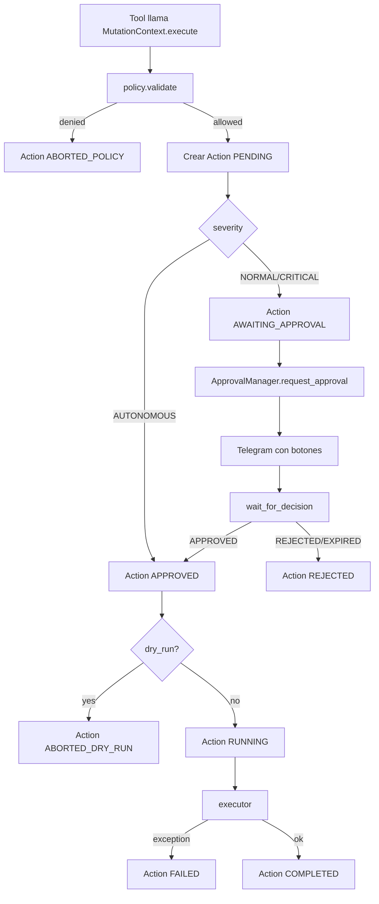
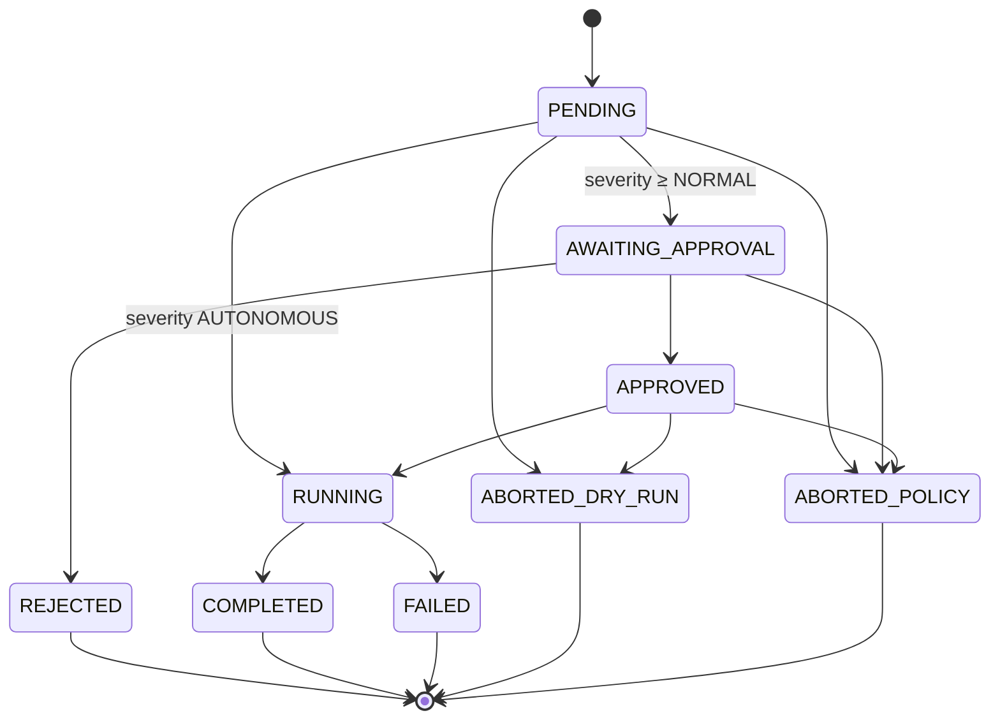

# 🧪 `MutationContext` — el sandwich de seguridad

> [!abstract] Una clase, cinco gatekeepers
> Archivo: `lobster_agent/agent/mutations/context.py`. Toda tool de mutación llama a `MutationContext.execute(...)`. Ese único método aplica **5 capas** en orden estricto antes de tocar K8s:
> 1. `policy.validate()` — política estática.
> 2. Severidad → enum (NORMAL/CRITICAL/AUTONOMOUS).
> 3. Si severidad ≥ NORMAL → `ApprovalManager.request_approval()` + `wait_for_decision()`.
> 4. Si modo `dry_run` → simula y registra.
> 5. Ejecuta `executor()` (lambda con el patch real a K8s) y persiste resultado.

## 🪜 Flujo paso a paso



## 🧾 `ActionResult` y `ActionStatus`

```python
@dataclass(frozen=True)
class ActionResult:
    action_id: str
    status: ActionStatus
    message: str
    data: dict[str, Any] | None = None
```

`ActionStatus` es el StrEnum en `persistence/models.py`:

```python
class ActionStatus(StrEnum):
    PENDING            = "pending"
    AWAITING_APPROVAL  = "awaiting_approval"
    APPROVED           = "approved"
    REJECTED           = "rejected"
    RUNNING            = "running"
    COMPLETED          = "completed"
    FAILED             = "failed"
    ABORTED_DRY_RUN    = "aborted_dry_run"
    ABORTED_POLICY     = "aborted_policy"
```

> [!info] Máquina de estados estricta
> Las transiciones se validan en `ActionRepository.update_status` contra `VALID_ACTION_TRANSITIONS`. Esto evita que un bug en una tool deje una `Action` en un estado imposible (p.ej. saltar `RUNNING` y poner directamente `COMPLETED`).

## 🛡️ Capa 1 — `policy.validate()`

Archivo: `lobster_agent/domain/policy.py`. Reglas (resumidas):

- ✅ Namespaces de sistema (`kube-system`, `kube-public`, `metallb-system`, `saasphere-system`) **bloqueados a fuego**.
- ✅ Solo namespaces con label `saasphere.io/tenant=true` aceptan mutación.
- ❌ Kinds prohibidos: `Secret`, `ServiceAccount`, `Role`, `RoleBinding`, `ClusterRole`, `ClusterRoleBinding`, `Pod` *(salvo Secret con `internal_tooling=True` para `deploy_tenant`)*.
- ❌ Recursos protegidos: cualquier referencia a `traefik`, `coredns`, `metrics-server`.
- ❌ Manifests con `privileged`, `hostPath`, `hostNetwork`, `hostPID`, `hostIPC`.
- ❌ Manifests sin `cpu+memory` limits (configurable con `enforce_resource_limits=False`).

Devuelve un `PolicyDecision(allowed, severity, reason, violations)`.

→ Detalle en [[../09-Tenants/06-Politica-namespaces]].

## ⚖️ Capa 2 — Severidad

Si `policy.validate()` devuelve `allowed=True`, la severidad sale de `ACTION_SEVERITIES`:

| action_type | severity |
|---|---|
| restart_pod | NORMAL (override a AUTONOMOUS en CrashLoopBackOff) |
| restart_deployment | NORMAL |
| delete_pod | NORMAL |
| update_configmap | NORMAL |
| apply_manifest | NORMAL |
| scale_deployment | NORMAL (CRITICAL si replicas=0 y no había scale-to-zero previo) |
| deploy_tenant | CRITICAL |
| delete_tenant | CRITICAL |
| pause_tenant | NORMAL |
| resume_tenant | AUTONOMOUS |
| verify_tenant_health | AUTONOMOUS |
| pin_deployment_to_node | NORMAL |
| unpin_deployment_from_node | AUTONOMOUS |
| annotate_resource | AUTONOMOUS |

> [!tip] AUTONOMOUS = sin aprobación humana
> Una mutación AUTONOMOUS no entra en `ApprovalManager`. La política asume que es reversible o suficientemente segura para no molestar al humano.

## ✋ Capa 3 — Aprobación humana

Solo se aplica si la severidad es `NORMAL` o `CRITICAL`:

```python
if severity != ActionSeverity.AUTONOMOUS:
    await repo.update_status(action.id, ActionStatus.AWAITING_APPROVAL)
    approval = await self._approval_manager.request_approval(ApprovalRequest(...))
    action.approval_id = approval.id
    ...
    if approval.status == ApprovalStatus.PENDING:
        approval = await self._approval_manager.wait_for_decision(approval.id)
    if approval.status != ApprovalStatus.APPROVED:
        return ActionResult(REJECTED, "approval rejected", ...)
```

→ Detalle del bloqueo asíncrono en [[06-Approval-manager]].

## 🧪 Capa 4 — Dry run

```python
if dry_run:
    action = await repo.update_status(action.id, ActionStatus.ABORTED_DRY_RUN, ...)
    return ActionResult(ABORTED_DRY_RUN, "dry run; mutation skipped", ...)
```

Activado por `dry_run_override` en la llamada o por `settings.agent.dry_run_default = True` globalmente.

> [!warning] Modo `dry_run` global ≠ flag por llamada
> Si `agent_state.mode == DRY_RUN`, el `ApprovalManager` auto-aprueba todo con `dry_run_auto_approved` pero **el MutationContext sigue mirando `dry_run_default`**. Si quieres un *ensayo real con aprobación auto*, pon `dry_run_default=False` y haz `state set dry_run`.

## 🚀 Capa 5 — Executor

```python
async def executor() -> dict[str, Any]:
    await ctx.deps.k8s.delete_pod(namespace, pod_name)
    return {"deleted": True, "namespace": namespace, "pod_name": pod_name, ...}
```

El executor es una closure pasada por la tool. Devuelve un dict que se persiste como `result` del `Action`. Si lanza excepción → `Action.status=FAILED` con `error` capturado.

## 🧬 Diagrama de estados de `Action`



→ Sigue en [[06-Approval-manager]].
