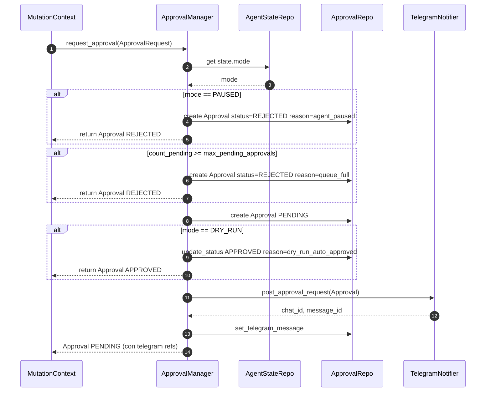

# ✋ `ApprovalManager`

> [!abstract] El humano dentro del bucle
> Archivo: `lobster_agent/agent/approvals.py`. Cuando una mutación NORMAL o CRITICAL se va a ejecutar, `MutationContext` llama a `ApprovalManager.request_approval()` y luego a `wait_for_decision()`. Eso **bloquea** la coroutine del agente durante minutos hasta que el operador responde por Telegram o el timeout vence.

## 📂 Modelo `Approval`

```python
class Approval(SQLModel, table=True):
    id: str (primary key)
    requested_at: datetime
    case_use: str
    action_type: str
    action_payload: dict[str, Any]   # JSON
    tenant_namespace: str | None
    severity: ApprovalSeverity        # NORMAL | CRITICAL
    status: ApprovalStatus            # PENDING | APPROVED | REJECTED | EXPIRED | CANCELLED
    expires_at: datetime
    decided_at: datetime | None
    decided_by_user_id: int | None
    decision_reason: str | None
    telegram_chat_id: int | None
    telegram_message_id: int | None
    reminder_count: int
    last_reminder_at: datetime | None
    related_decision_id: str | None
```

## 🔄 `request_approval()`



## ⏳ `wait_for_decision()`

```python
async def wait_for_decision(self, approval_id, poll_interval_seconds=1.0):
    while True:
        approval = await repo.get(approval_id)
        if approval.status != ApprovalStatus.PENDING:
            return approval
        if approval.expires_at <= now:
            return repo.update_status(EXPIRED)
        await asyncio.sleep(poll_interval_seconds)
```

> [!warning] Polling de la DB
> Es un poll de 1 segundo a la DB SQLite — barato, simple, sin necesidad de canal pubsub. El downside es que el tiempo de respuesta percibido (humano aprueba → agente continúa) puede tener hasta 1 s de latencia añadida. Suficiente para el dominio.

## ⌛ Timeouts y recordatorios

```python
class ApprovalConfig(BaseModel):
    default_timeout_seconds: int = 600              # 10 min para NORMAL
    critical_timeout_seconds: int = 3600            # 1 h para CRITICAL
    critical_reminder_interval_seconds: int = 60    # recordatorio cada 1 min si CRITICAL
    max_pending_approvals: int = 50
```

> [!info] CRITICAL recibe recordatorios
> El `ApprovalMaintenanceLoop` corre cada `min(30, critical_reminder/2)` segundos y:
> 1. Marca expiradas como EXPIRED y avisa al operador.
> 2. Para CRITICAL aún PENDING, envía recordatorio cada `critical_reminder_interval_seconds`.
> 3. Actualiza la métrica `lobster_approvals_pending`.

## 🧹 `ApprovalMaintenanceLoop`

Es una tarea de fondo arrancada en `main.py`:

```python
maintenance_loop = ApprovalMaintenanceLoop(...)
await maintenance_loop.start()
```

Funciones del tick:

| Función | Qué hace |
|---|---|
| `expire_overdue(now)` | Marca como EXPIRED las que pasaron `expires_at` |
| `list_expired_decided_since` | Para emitir mensaje "⌛ Expirada" al operador |
| `list_pending_critical_due_for_reminder` | Selecciona las CRITICAL con `last_reminder_at` viejo o nulo |
| `send_reminder` + `increment_reminder` | Re-envía mensaje y aumenta contador |
| `lobster_approvals_pending.set(count_pending())` | Actualiza la gauge |

## 🚫 Casos límite

> [!danger] Si el bot Telegram está caído
> `request_approval` sigue creando la `Approval` en la base. Lo único que falla es `notifier.post_approval_request` (que retorna `(0, 0)`). El humano no se entera, pero la cola sigue creciendo. **Mejor activar `state set paused` en LeIA si el bot está caído mucho rato.**

> [!warning] Si la cola está llena
> Cuando `count_pending() >= max_pending_approvals` (50 por defecto), la nueva `Approval` se crea ya en estado REJECTED con `reason=queue_full`. La mutación se anula. Esto previene cascadas de aprobaciones tras una tormenta de alertas.

## 🔗 Conexión con Telegram

- El bot registra dos callback handlers en `telegram/handlers.py`:
  - `handle_approve_callback` → cambia status a APPROVED.
  - `handle_reject_callback` → cambia status a REJECTED.
- El botón `pause_all` cambia `agent_state.mode = DRY_RUN` (no afecta a aprobaciones ya pendientes).

→ Detalle visual en [[../04-Telegram/03-Aprobaciones-inline]].

## 🧪 Test unitarios

- `tests/test_approval_manager.py` — comportamiento del manager (paused, queue_full, dry_run, telegram refs).
- `tests/test_approval_repository.py` — máquina de estados de la fila SQLite.
- `tests/test_approval_maintenance_loop.py` — expiraciones y recordatorios.
- `tests/test_cli_phase4.py` — comandos `lobster approvals …`.

→ Sigue en [[07-Agent-state-modos]].
