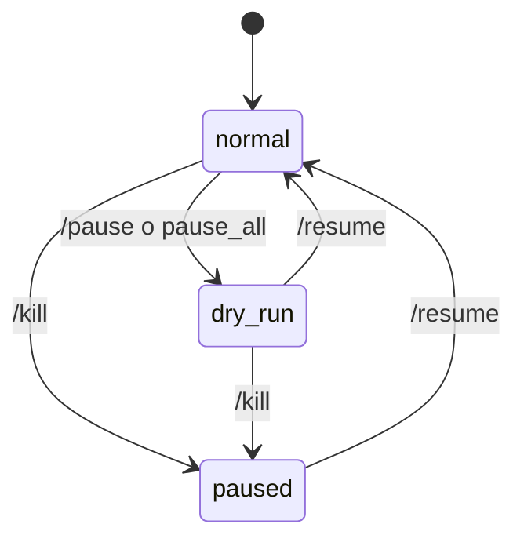

# 🚦 `AgentState` — los tres modos

> [!abstract] Una sola fila para mandar sobre todo
> Tabla `agent_state` en SQLite, **una sola fila** (id=1). Cambia el modo global y todo el agente cambia su comportamiento. Es la palanca de emergencia.

## 🎛️ Los tres modos

| Modo | Emoji | LLM se ejecuta | Aprobaciones | Mutaciones reales |
|---|---|---|---|---|
| 🟢 `normal` | ☑️ | ✅ | piden al humano | ✅ |
| 🟡 `dry_run` | 🟡 | ✅ | auto-aprueban con `dry_run_auto_approved` | ❌ (`ABORTED_DRY_RUN`) |
| 🔴 `paused` | ⛔ | ❌ | nuevas se rechazan `agent_paused` | ❌ |

## 🧬 Modelo

```python
class AgentMode(StrEnum):
    NORMAL = "normal"
    DRY_RUN = "dry_run"
    PAUSED = "paused"

class AgentState(SQLModel, table=True):
    id: int = 1                           # single-row
    mode: AgentMode = AgentMode.NORMAL
    reason: str | None = None
    changed_at: datetime
    changed_by_user_id: int | None        # quién lo cambió por Telegram
```

## 🔀 Cómo cambiar de modo

> [!example] Tres caminos equivalentes
> 1. **CLI**:
>    ```bash
>    uv run lobster state set normal
>    uv run lobster state set dry_run --reason "probando refactor"
>    uv run lobster state set paused --reason "incidencia infra"
>    ```
> 2. **Telegram**:
>    - `/pause [razón]` → DRY_RUN
>    - `/resume` → NORMAL
>    - `/kill [razón]` → PAUSED
>    - Botón inline "Pausar todo" en cualquier aprobación → DRY_RUN
> 3. **Programático** (en código):
>    ```python
>    await agent_state_repo.set_mode(AgentMode.DRY_RUN, "razon", user_id)
>    ```

## 🛡️ Efectos en cada parte del sistema

### En `LobsterAgent.run`

```python
if state.mode == AgentMode.PAUSED:
    decision = Decision(..., conclusion="Agent paused; LLM cycle skipped.")
    return AgentResult(outcome="skipped_paused", ...)
```

→ Ahorra **todo** el coste LLM. Idóneo durante incidencias o cuando reinicias Ollama.

### En `ApprovalManager.request_approval`

```python
if state.mode == AgentMode.PAUSED:
    approval.status = ApprovalStatus.REJECTED
    approval.decision_reason = "agent_paused"
    return await approval_repo.create(approval)

# y después:
if state.mode == AgentMode.DRY_RUN:
    return await approval_repo.update_status(approval.id, APPROVED, None, "dry_run_auto_approved")
```

### En `MutationContext.execute`

El `MutationContext` **no mira** el `mode` directamente — recibe la respuesta del `ApprovalManager`. En `DRY_RUN` la mutación llega aprobada pero `dry_run_default` debe estar a True para que abort en `ABORTED_DRY_RUN`.

> [!tip] Combo común
> Para una sesión de pruebas:
> ```bash
> uv run lobster state set dry_run --reason "ensayo"
> # luego edita /etc/lobster/config.toml:
> # [agent] dry_run_default = true
> # systemctl restart lobster
> ```

## 🚏 Estados típicos del operador



## 👀 Cómo saber en qué modo está

```bash
uv run lobster state get
# normal changed_at=2026-05-15T22:18:43+00:00 reason=-
```

O en Telegram:
```
/status
🟢 Modo: normal
📊 Pendientes: 0
🔍 Última decisión: approved
```

## 🧪 Test unitarios

- `tests/test_agent_state_repository.py` — set/get del modo.
- `tests/test_telegram_handlers.py` — comandos `/pause`, `/resume`, `/kill`.
- `tests/test_orchestrator.py::test_paused_skip` — el agente devuelve `skipped_paused` sin tocar Ollama.

→ Cierre del bloque agente. Sigue en [[../03-Tools/00-MOC-Tools|MOC Tools]].
