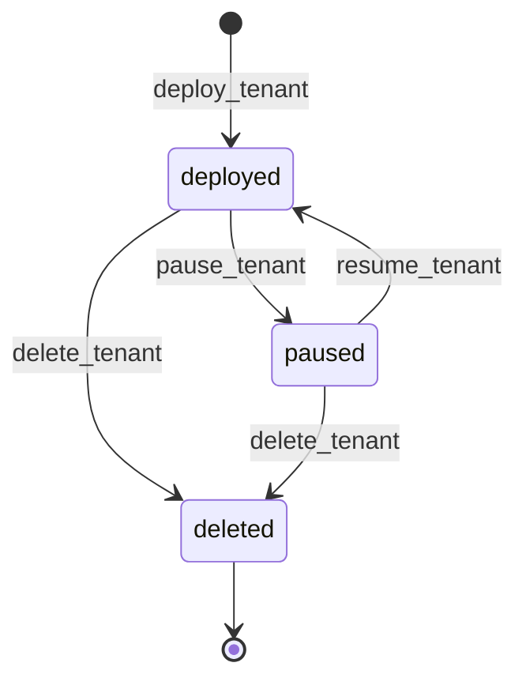

# 🏢 Mutations · Tenants

> [!abstract] 5 tools para el ciclo de vida del tenant
> Archivo: `lobster_agent/agent/tools/mutations/tenant.py`. Cada tenant es un **namespace entero** con su Deployment, Service, Ingress, PVC y ResourceQuota.

## 🚀 `deploy_tenant(tenant_type, name, tier="free", hostname=None, image=None, port=80, env=None, owner=None, admin_email=None)`

> [!danger] Siempre CRITICAL
> Crea recursos nuevos en K8s y pide aprobación. Si la aprobación caduca o se rechaza, no toca nada.

> [!example] Validaciones tempranas
> - `name` debe ser **DNS-1123 label** (regex `^[a-z0-9]([-a-z0-9]{0,61}[a-z0-9])?$`).
> - `tenant_type` debe ser `wordpress | static_site | web_app`.
> - `tier` debe ser `free | basic | premium`.
> - `web_app` requiere `image`.
> - `wordpress` requiere `admin_email`.

> [!info] Pipeline interno
> 1. **Renderiza** la plantilla Jinja2 (`lobster_agent/manifests/<type>.yaml.j2`).
> 2. **Valida cada recurso** contra `policy.validate("apply_manifest", ...)` para detectar violaciones (privileged, hostPath, etc.) **antes** de pedir aprobación.
> 3. **Pide aprobación CRITICAL** vía Telegram.
> 4. **Ordena los recursos** por dependencia (`Namespace → Secret → PVC → ResourceQuota → Deployment → Service → Ingress`).
> 5. **Aplica uno por uno**. Si uno falla, hace `delete_namespace(name)` para limpiar.
> 6. Para `static_site`: espera el PVC bound y lee el `hostPath` del PV para informar al operador a dónde subir HTML.

> [!tip] Mensaje de éxito por tipo
> - `static_site` → *"tenant deployed: https://<hostname>; scp target: matrix:<hostPath>"*
> - `wordpress` → *"tenant deployed: https://<hostname>; admin: https://<hostname>/wp-admin"*
> - `web_app` → *"tenant deployed: https://<hostname>; namespace: <name>"*

→ Plantillas en [[../09-Tenants/04-Plantillas-Jinja2]].

## 🗑️ `delete_tenant(namespace, confirm_namespace)`

> [!danger] CRITICAL + confirmación textual
> ```python
> if confirm_namespace != namespace:
>     return "delete_tenant refused: confirm_namespace must exactly match namespace"
> ```
> El operador (o LLM) debe **repetir literalmente** el namespace como confirmación. Además se verifica que el namespace lleva `saasphere.io/tenant=true`.

> [!info] Mecanismo
> `DELETE` del Namespace → cascada elimina todo dentro. Severidad: `CRITICAL`.

## ⏸️ `pause_tenant(namespace)`

> [!info] Scale-to-zero con memoria
> ```python
> # antes:
> annotations = {f"saasphere.io/paused-replicas-{name}": str(replicas) for ...}
> patch_namespace_annotations(namespace, annotations)
> for deployment, _ in replica_map.items():
>     scale_deployment(namespace, deployment, 0)
> ```
> Guarda las replicas originales en **annotations del Namespace** para que `resume_tenant` sepa a qué número volver. Severidad: `NORMAL`.

## ▶️ `resume_tenant(namespace)`

> [!info] AUTONOMOUS
> Lee las annotations `saasphere.io/paused-replicas-*` y escala cada deployment al valor original. Severidad: `AUTONOMOUS` — el agente puede despertar tenants sin pedir aprobación, ya que es la inversa de una operación segura.

> [!warning] Si las annotations no existen
> Devuelve `"resume_tenant failed before action creation: tenant was not paused"`. No es error: el tenant simplemente no estaba pausado.

## 🩺 `verify_tenant_health(namespace)`

> [!info] AUTONOMOUS, read-only en realidad
> Aunque está registrada como mutación (para que aparezca en el ledger), no muta nada. Comprueba en una sola llamada:
> - Deployments con `ready != replicas` → unhealthy.
> - Pods en CrashLoopBackOff.
> - PVCs no Bound.
> - Ingresses configurados.
>
> Devuelve un dict `{ok, unhealthy_deployments, crashloop_pods, ingresses, unbound_pvcs, warnings}`.

## 🧭 Ciclo de vida tenant



→ Continúa en [[../09-Tenants/05-Ciclo-de-vida]].
