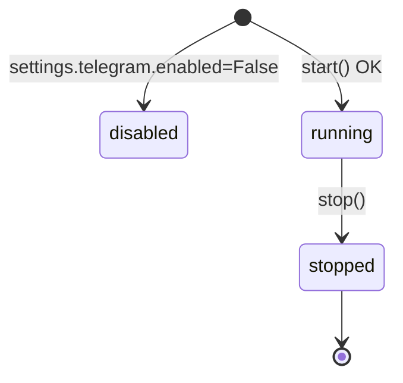

# 🤖 Telegram · Bot runner

> [!abstract] Ciclo de vida del bot
> Archivo: `lobster_agent/telegram/bot.py`. `TelegramBotRunner` gestiona el bot aiogram v3: lo arranca con `start_polling` en una tarea aparte, lo apaga limpio en shutdown, y mantiene una sola sesión HTTP compartida con `TelegramNotifier`.

## 🧬 Estructura

```python
class TelegramBotRunner:
    def __init__(self, settings, approval_repo_factory, agent_state_repo_factory,
                 notifier, agent, memory, tool_request_repo_factory=None):
        self.bot: Bot | None = None
        self.dispatcher: Dispatcher | None = None
        self._task: asyncio.Task[None] | None = None

    async def start(self): ...
    async def stop(self): ...
    async def _poll(self): ...
```

## 🔌 Arranque

```python
async def start(self):
    if not settings.telegram.enabled or not settings.telegram.bot_token:
        return
    self.bot = self.notifier.bot or Bot(settings.telegram.bot_token)
    self.notifier.bot = self.bot   # comparten Bot instance
    self.dispatcher = Dispatcher(
        settings=settings,
        approval_repo_factory=...,
        agent_state_repo_factory=...,
        notifier=...,
        agent=...,
        memory=...,
        tool_request_repo_factory=...,
    )
    self.dispatcher.include_router(build_router())
    self._task = asyncio.create_task(self._poll())
```

> [!tip] Inyección de dependencias por workflow_data
> `aiogram v3` permite pasar kwargs al `Dispatcher` que llegan a los handlers como parámetros. Lobster aprovecha esto para pasar `settings`, repos, notifier, agente y memoria sin globals.

## 🔄 Polling

```python
async def _poll(self):
    await self.dispatcher.start_polling(
        self.bot,
        polling_timeout=settings.telegram.polling_timeout_seconds,   # 30 s
        handle_signals=False,
        close_bot_session=False,
    )
```

> [!info] No usamos webhook
> El bot vive en LeIA (red privada). No queremos exponer puerto HTTPS público para Telegram, así que polling es la opción correcta.

## 🛑 Parada

```python
async def stop(self):
    if self.dispatcher is not None:
        await asyncio.wait_for(self.dispatcher.stop_polling(), timeout=10)
    if self._task is not None and not self._task.done():
        self._task.cancel()
    if self.bot is not None:
        await self.bot.session.close()
```

> [!warning] `close_bot_session=False`
> Decisión deliberada: `TelegramNotifier` y el bot comparten sesión. Si `start_polling` la cierra al finalizar, `notifier.send_alert` falla después. Por eso aiogram no toca la sesión y `stop()` la cierra explícitamente al final.

## 🚦 Estados del Runner



## ⚙️ Configuración

```python
class TelegramConfig(BaseModel):
    bot_token: str = ""
    allowed_user_ids: list[int] = []
    enabled: bool = False
    polling_timeout_seconds: int = 30
```

> [!example] config.toml
> ```toml
> [telegram]
> enabled = true
> bot_token = "..."
> allowed_user_ids = [123456789]
> polling_timeout_seconds = 30
> ```

→ Sigue en [[02-Handlers-comandos]].
