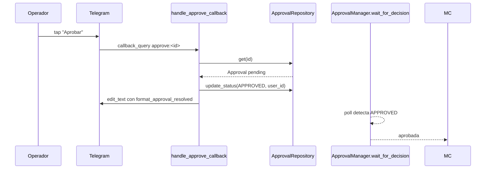
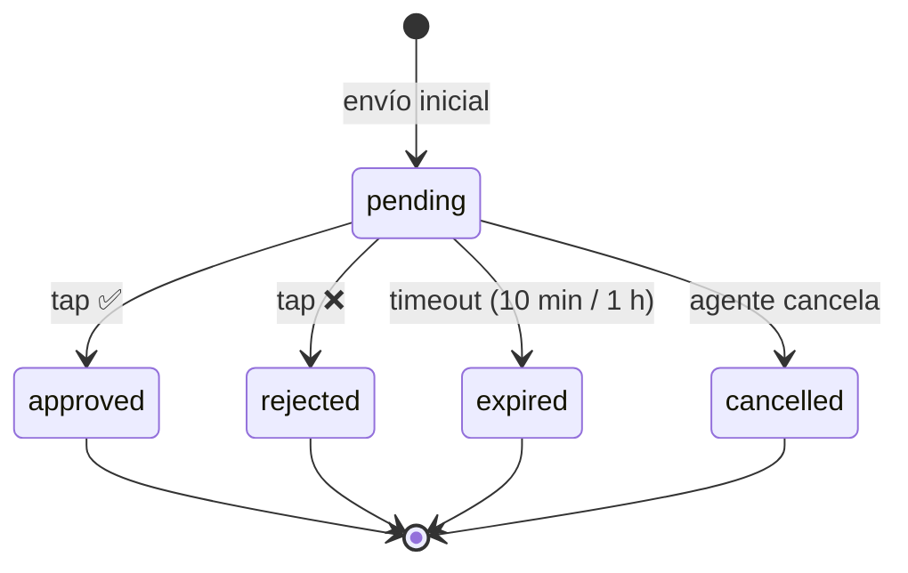

# ✅❌ Telegram · Aprobaciones inline

> [!abstract] El humano aprueba con un dedo
> Cuando hay que aprobar una mutación, el bot envía un mensaje **con tres botones inline**: ✅ Aprobar · ❌ Rechazar · ⏸️ Pausar todo. El operador toca un botón y el agente continúa o aborta.

## 🎨 El mensaje

> [!example] Aspecto real
> ```
> 🔔 *Solicitud de aprobación* ⚠️
>
> ⚡ *Acción:* restart_deployment
> 🏷️ *Caso de uso:* alert_reactive
> 🏠 *Tenant:* tenant-acme
>
> 📋 *Detalle:*
> ```
> {
>   "current_replicas": 2,
>   "deployment_name": "wordpress",
>   "namespace": "tenant-acme",
>   "ready_replicas": 0
> }
> ```
>
> ⏰ _Caduca: 2026-05-16T17:45:00+00:00 (8 min)_
> 🆔 `a5f23c91`
>
> [ Aprobar ] [ Rechazar ]
> [    Pausar todo    ]
> ```

## ⌨️ El keyboard

```python
def approval_keyboard(approval_id: str) -> InlineKeyboardMarkup:
    return InlineKeyboardMarkup(
        inline_keyboard=[
            [
                InlineKeyboardButton(text="Aprobar", callback_data=f"approve:{approval_id}"),
                InlineKeyboardButton(text="Rechazar", callback_data=f"reject:{approval_id}"),
            ],
            [InlineKeyboardButton(text="Pausar todo", callback_data="pause_all")],
        ]
    )
```

## 🔄 Flujo de callback



## 📋 `format_approval_resolved`

> [!example] Después del tap
> ```
> ✅ *Aprobada* · restart_deployment
> 👤 *Por:* @angelmq152
> 🕐 *A las:* 2026-05-16T17:38:12+00:00
> ```
> Si fue rechazada, el emoji cambia a ❌ y aparece `_*Motivo:*_ rejected_from_telegram`.

## 🚏 Estados del mensaje



Cada transición edita el mensaje (`edit_text`) en lugar de enviar uno nuevo — el chat queda limpio.

## ⏸️ El botón "Pausar todo"

> [!warning] No es lo mismo que rechazar
> Tap a "Pausar todo" hace:
> ```python
> repo.set_mode(AgentMode.DRY_RUN, "telegram_pause_all", user_id)
> notifier.send_alert("🟡 Modo cambiado a dry_run")
> ```
> La aprobación actual queda **pendiente**. El nuevo modo `DRY_RUN` solo afecta a aprobaciones nuevas (que se auto-aprobarán con dry_run sin tocar K8s).
>
> Si quieres rechazar Y cambiar modo, toca primero "Rechazar" y luego "Pausar todo".

## 🔄 Recordatorios para CRITICAL

> [!info] `ApprovalMaintenanceLoop`
> Cada `critical_reminder_interval_seconds` (60 s por defecto), las CRITICAL aún pendientes reciben un mensaje nuevo (no edición):
> ```
> ⏰ Recordatorio: aprobación `a5f23c91` sigue pendiente.
> ```
> Esto evita que se olvide en el chat.

→ Lógica en [[../02-Agente/06-Approval-manager]].
