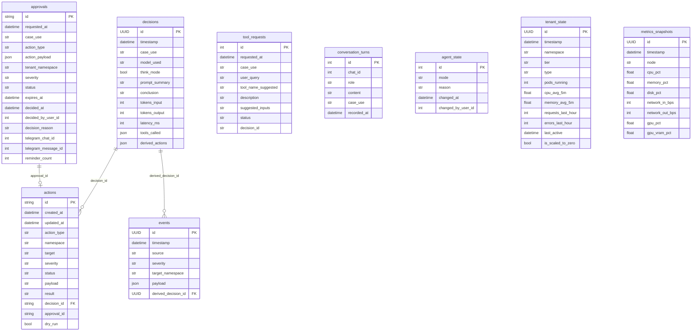

# 🗄️ SQLite · Esquema global

> [!abstract] Una base, 9 tablas
> Archivo: `lobster_agent/persistence/models.py`. SQLite local en `/var/lib/lobster/state.db`. ORM con SQLModel (= SQLAlchemy + Pydantic). Driver async = `aiosqlite`.

## 📐 Diagrama del esquema



## 🚀 Creación de la base

```python
async def create_db_schema(engine: AsyncEngine):
    async with engine.begin() as conn:
        await conn.run_sync(SQLModel.metadata.create_all)
```

`SQLModel.metadata` ya conoce todas las tablas por el import lateral en `persistence/db.py`:

```python
from lobster_agent.persistence import models as _models  # noqa: F401
```

## ⚙️ PRAGMAs SQLite

```python
@event.listens_for(engine.sync_engine, "connect")
def enable_sqlite_pragmas(dbapi_connection, _):
    cursor = dbapi_connection.cursor()
    cursor.execute("PRAGMA journal_mode=WAL")
    cursor.execute("PRAGMA synchronous=NORMAL")
    cursor.execute("PRAGMA foreign_keys=ON")
```

> [!info] Por qué WAL
> Permite lecturas concurrentes mientras se escribe. Esencial porque el scheduler + watcher + telegram + CLI pueden estar accediendo simultáneamente.

> [!warning] foreign_keys=ON
> SQLite **no aplica FK** por defecto. Esto las activa para que `actions.decision_id` y `events.derived_decision_id` se validen.

## 🧬 `StrEnumValueType` — el truco de enums

```python
class StrEnumValueType(TypeDecorator[str]):
    impl = String
    def process_bind_param(self, value, dialect):
        if isinstance(value, self.enum_type):
            return value.value
        ...
    def process_result_value(self, value, dialect):
        return _normalize_enum_string(self.enum_type, value)
```

> [!tip] Por qué este TypeDecorator existe
> Cuando SQLModel persiste un `StrEnum`, guarda el `.value` (string limpio) pero al leer lo reconvierte. Versiones antiguas guardaron `ApprovalStatus.APPROVED` literalmente como string "ApprovalStatus.APPROVED". Este decorator normaliza ambos casos.

## 📍 Configuración

```python
class DatabaseConfig(BaseModel):
    url: str = "sqlite+aiosqlite:////var/lib/lobster/state.db"
```

Cambiable en `[database].url` del TOML o `LOBSTER_DATABASE__URL` en env.

## 🛠️ Mantenimiento

### Backup manual
```bash
sqlite3 /var/lib/lobster/state.db ".backup '/tmp/lobster-backup-$(date +%F).db'"
```

### Vacuum
```bash
sqlite3 /var/lib/lobster/state.db "VACUUM;"
```

### Inspección rápida
```bash
sqlite3 /var/lib/lobster/state.db "SELECT case_use, COUNT(*) FROM decisions GROUP BY case_use ORDER BY 2 DESC;"
```

→ Detalle de cada tabla en notas siguientes.
