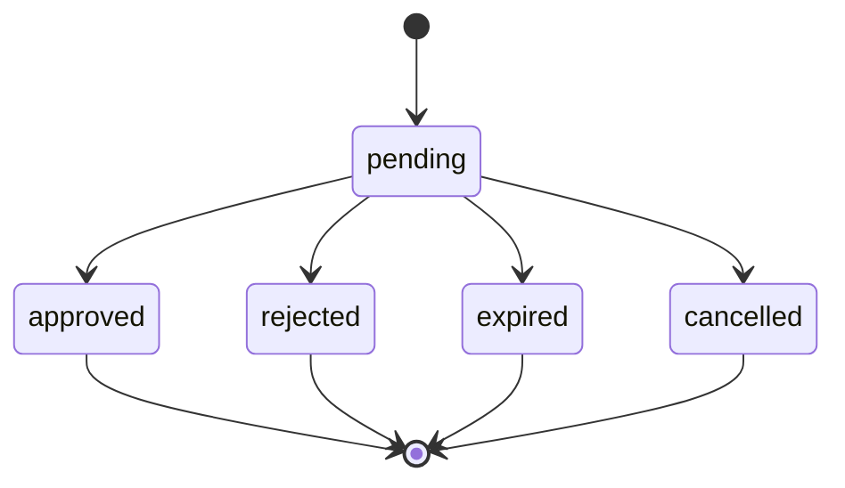

# ✋ Tabla `approvals`

> [!abstract] Una fila por petición humana
> Cada `MutationContext.execute(...)` con severidad NORMAL/CRITICAL crea una fila aquí. Vive hasta que el humano decide, expira, o se cancela.

## 📐 Modelo

```python
class Approval(SQLModel, table=True):
    id: str (PK)                          # uuid string
    requested_at: datetime
    case_use: str
    action_type: str
    action_payload: dict (JSON)
    tenant_namespace: str | None
    severity: ApprovalSeverity            # normal | critical
    status: ApprovalStatus                # pending | approved | rejected | expired | cancelled
    expires_at: datetime
    decided_at: datetime | None
    decided_by_user_id: int | None
    decision_reason: str | None
    telegram_chat_id: int | None
    telegram_message_id: int | None
    reminder_count: int = 0
    last_reminder_at: datetime | None
    related_decision_id: str | None
```

## 🚦 Máquina de estados



Terminal en todos los casos salvo pending.

## ⏰ Timeouts

| Severidad | Timeout | Recordatorios |
|---|---|---|
| `normal` | 600 s (10 min) | ❌ |
| `critical` | 3600 s (1 h) | cada 60 s |

## 📋 Operaciones (ApprovalRepository)

```python
async def create(approval) -> Approval
async def get(id) -> Approval | None
async def list_pending() -> list[Approval]
async def list_recent(limit=20, status=None)
async def update_status(id, new_status, decided_by_user_id, decision_reason)
async def increment_reminder(id)
async def set_telegram_message(id, chat_id, message_id)
async def expire_overdue(now) -> int
async def list_expired_decided_since(since) -> list[Approval]
async def count_pending() -> int
async def list_pending_critical_due_for_reminder(now, interval) -> list[Approval]
```

## 🧪 Casos especiales

> [!info] Cuando `mode == PAUSED`
> El manager crea la fila ya en estado `REJECTED` con `decision_reason="agent_paused"`. El Telegram **no se envía** (status no es pending).

> [!info] Cuando `count_pending >= max_pending_approvals` (50)
> Igual: fila REJECTED con `reason="queue_full"`. Sirve como freno de tormentas.

> [!info] Cuando `mode == DRY_RUN`
> Fila se crea PENDING y se actualiza inmediatamente a `APPROVED` con `reason="dry_run_auto_approved"`. El bucle del MutationContext sigue, pero abortará en la capa dry_run si `dry_run_default=True`.

## 📋 Inspección operativa

```bash
uv run lobster approvals list
2026-05-16T17:30 ab12cd34 pending  normal restart_deployment
2026-05-16T17:25 99887766 approved critical deploy_tenant

uv run lobster approvals show <id>
{
  "action_payload": {...},
  "decided_at": "...",
  "decision_reason": null,
  "expires_at": "...",
  ...
}
```

→ Ver flujo end-to-end en [[../02-Agente/06-Approval-manager]].
