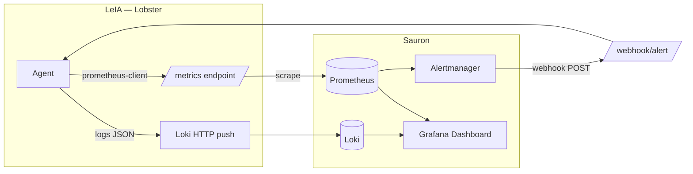

# 📊 06 · Observabilidad — MOC

> [!abstract] Lobster observado y observador
> El agente **se observa a sí mismo** (métricas Prometheus + logs structlog) y **observa el clúster** (consultas a Prometheus y Loki desde sus tools). Hay un dashboard de Grafana, alertas de Prometheus y un webhook que cierra el bucle: cuando Alertmanager dispara, llama de vuelta a Lobster.

## Notas

- [[01-Logs-structlog-Loki]] — el pipeline de logs.
- [[02-Metricas-Prometheus]] — todas las métricas que expone.
- [[03-Dashboard-Grafana]] — dashboard provisto.
- [[04-Alertas-Prometheus]] — reglas en `deploy/prometheus/lobster.rules.yaml`.
- [[05-Webhook-Alertmanager]] — `/webhook/alert` y el modo reactivo.

## Vista de conjunto

## Endpoints HTTP que Lobster expone

| Path | Método | Función |
|---|---|---|
| `/health` | GET | Estado + uptime |
| `/metrics` | GET | Métricas Prometheus |
| `/webhook/alert` | POST | Recibe alertas de Alertmanager |
| `/admin/jobs` | GET | Lista jobs del scheduler |
| `/admin/trigger/{job_id}` | POST | Fuerza ejecución inmediata |
