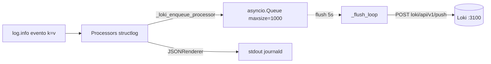

# 📜 Logs · `structlog` → Loki

> [!abstract] Logs estructurados sin esfuerzo
> Archivo: `lobster_agent/observability/logging.py`. Cada llamada `log.info("evento.algo", k=v, ...)` produce un dict JSON que se imprime por stdout (a journald) Y se encola para push a Loki en lotes.

## 🧬 Configuración

```python
structlog.configure(
    processors=[
        structlog.stdlib.add_log_level,
        structlog.processors.TimeStamper(fmt="iso"),
        structlog.processors.StackInfoRenderer(),
        structlog.processors.format_exc_info,
        _loki_enqueue_processor,                  # ← se mete en la cola
        structlog.processors.JSONRenderer(),
    ],
    wrapper_class=structlog.make_filtering_bound_logger(level),
    context_class=dict,
    logger_factory=structlog.PrintLoggerFactory(),
    cache_logger_on_first_use=True,
)
```

## 📨 Pipeline al push



## ⚙️ Tuning

```python
class LokiConfig(BaseModel):
    url: str = "http://192.168.1.201:3100"
    push_path: str = "/loki/api/v1/push"
    batch_size: int = 100
    flush_interval_seconds: int = 5
    timeout_seconds: float = 5.0
```

## 📤 Push payload

```json
{
  "streams": [
    {
      "stream": { "service": "lobster", "host": "leia" },
      "values": [
        ["1747510320000000000", "{\"event\":\"lobster.decision.completed\",...}"],
        ...
      ]
    }
  ]
}
```

> [!tip] Stream labels
> Solo `service=lobster` y `host=leia` van como labels Loki. El resto del log (campos custom como `case_use`, `decision_id`, …) viaja dentro del JSON del value y se accede con `| json` en LogQL.

## 🛡️ Comportamiento en fallos

> [!warning] Loki caído ≠ Lobster caído
> Si Loki no responde:
> - El POST se hace en `try/except`, no se propaga la excepción.
> - Los logs SIGUEN saliendo por stdout (journald los recoge).
> - El batch se "pierde" (no se reencola).
>
> Decisión consciente: la observabilidad no debe romper el agente.

## 📈 Métrica del backlog

```python
lobster_loki_queue_size = Gauge(
    "lobster_loki_queue_size",
    "Number of log entries waiting in the Loki push queue",
)
```

Si la cola crece, hay congestión hacia Loki. Si llega a 1000 (maxsize), nuevos logs se descartan silenciosamente.

## 🔍 LogQL útiles en Grafana

```logql
# Todos los logs de Lobster
{service="lobster"}

# Solo errores estructurados
{service="lobster"} | json | level="error"

# Decisiones de un case_use
{service="lobster"} | json | event="lobster.decision.completed" | case_use="daily_summary"

# Latencia LLM > 60 s
{service="lobster"} | json | event="lobster.decision.completed" | latency_ms > 60000
```

## 🚏 Arranque y parada

```python
# En main.py:
if settings.environment == "prod":
    await start_loki_flusher()
# Al apagar:
await stop_loki_flusher()  # cancela tarea + flushea la cola pendiente
```

> [!info] En dev no se arranca el flusher
> `environment="dev"` saltea Loki y deja solo stdout. Eso permite testear en local sin Loki corriendo.

→ Sigue en [[02-Metricas-Prometheus]].
