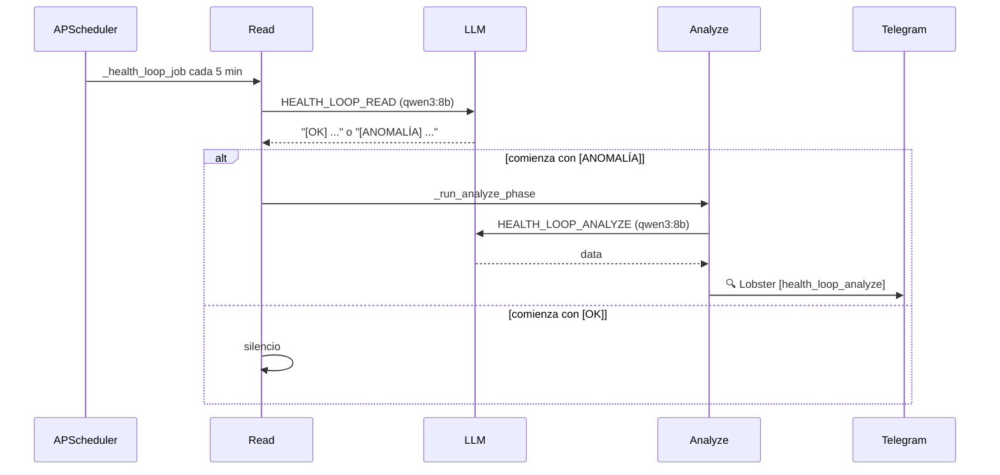

# 🩺 Health loop

> [!abstract] El "marcapasos" de Lobster
> Cada 5 minutos se ejecuta `health_loop_read`. Si detecta una `[ANOMALÍA]`, encadena `health_loop_analyze` que puede mutar el clúster. Es el bucle más importante del agente.

## 🩺 Fase 1 — `health_loop_read`

> [!example] Prompt completo
> El prompt (truncado) le pide al LLM tres cosas:
> ```text
> (A) Pods: lista pods en todos los namespaces de tenant y comprueba su
>     estado real. Si hay algún pod en CrashLoopBackOff, OOMKilled,
>     ImagePullBackOff o con más de 5 reinicios, marca el problema con
>     '[ANOMALÍA]'.
> (B) Presión de matrix: llama a get_node_health('matrix'). Si matrix está
>     NotReady o supera el umbral PIN (CPU > 85% o memoria > 85%),
>     marca con '[ANOMALÍA]' y empieza la descripción con
>     'matrix bajo presión'.
> (C) Workloads pinados pendientes de devolver: lista deployments en
>     namespaces de tenant. Si alguno tiene nodeSelector
>     kubernetes.io/hostname=fallback Y matrix está Ready con CPU < 70%
>     y memoria < 70%, marca con '[ANOMALÍA]' y empieza la descripción
>     con 'workloads pinados a fallback con matrix recuperado'.
>
> REGLAS de marcado: tu respuesta debe empezar EXACTAMENTE con '[ANOMALÍA]'
> si detectaste cualquiera de A/B/C, o con '[OK]' si todo está sano.
> ```

> [!warning] La detección es por **prefijo**, no por keywords
> ```python
> _ANOMALY_PREFIX_RE = re.compile(r'\s*\[\s*anomal', re.IGNORECASE)
> def _has_anomaly(text):
>     return bool(_ANOMALY_PREFIX_RE.match(text or ""))
> ```
> Las primeras versiones buscaban keywords ("crashloopbackoff", "oomkill") dentro del cuerpo del texto, pero salían **falsos positivos**: el LLM escribía *"no presentan errores como CrashLoopBackOff"* y eso disparaba un analyze caro que terminaba inventándose un pod. La regla `[OK]/[ANOMALÍA]` al inicio elimina el problema.

## 🔍 Fase 2 — `health_loop_analyze`

> [!example] Prompt
> ```text
> IMPORTANTE: usa SIEMPRE las herramientas disponibles para obtener datos
> reales antes de hacer cualquier recomendación. Nunca uses nombres de pod
> o deployment de ejemplo — obtén el nombre exacto con list_pods o list_deployments.
>
> Si la anomalía es un POD en mal estado:
> 1. list_pods (sin namespace) para enumerar todos los pods reales.
> 2. Si la lectura previa menciona un pod, COMPRUEBA primero que aparece
>    en list_pods. Si no aparece, NO inventes: responde
>    'Pod referenciado no existe en list_pods, abortando análisis' y termina sin actuar.
> 3. Con el pod confirmado, get_pod_logs para ver el error exacto.
> 4. Decide la acción. Si el pod está en CrashLoopBackOff confirmado por
>    las herramientas, reinícialo de forma autónoma con restart_pod.
>    Para cualquier otra acción destructiva, solicita aprobación.
>
> Si la anomalía es 'matrix bajo presión': ...
> Si la anomalía es 'workloads pinados a fallback con matrix recuperado': ...
> ```

## 🔁 Encadenamiento read → analyze



## ⚙️ Diferencias entre las dos fases

| Aspecto | READ | ANALYZE |
|---|---|---|
| Notify Telegram | ❌ (solo si chain) | ✅ |
| Tools | reading + memory + alertmanager | reading + mutations + loki |
| Timeout | 300 s | 900 s |
| Severidad de acciones | n/a | AUTONOMOUS (CrashLoop), NORMAL/CRITICAL en otros |
| Save Obsidian | ❌ | ❌ |

## 🛡️ Anti-spam

Como READ es silencioso (`notify=False`), Telegram NO recibe nada en condiciones normales. Solo cuando hay `[ANOMALÍA]` y se ejecuta ANALYZE el operador ve un mensaje. Eso evita inundar el chat con "todo OK" cada 5 minutos.

## 📈 Métricas relevantes

- `lobster_last_cycle_timestamp{case_use="health_loop_read"}` debería actualizarse cada 5 min.
- `lobster_scheduler_runs_total{case_use="health_loop_read", outcome="success"}` cuenta exitosos.
- Las alertas Prometheus `LobsterSinActividad` vigilan que esto no falle.

→ Análisis profundo en `obsidian/TFG_Fase6_Lobster.md`.
