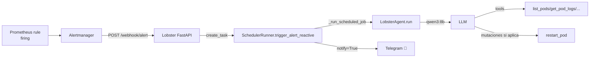

# 🚨 Alert reactive

> [!abstract] El agente reacciona a alertas Prometheus
> Cuando Alertmanager dispara una alerta, hace POST a `/webhook/alert`. El handler en `main.py` invoca `SchedulerRunner.trigger_alert_reactive(payload)`, que enruta como `CaseUse.ALERT_REACTIVE`.

## 🛣️ Camino completo



## 📝 Prompt construido

```python
prompt = (
    f"Alertmanager ha disparado un webhook. Estado: {status}.\n"
    f"Etiquetas comunes: {labels}\n"
    f"Anotaciones: {annotations}\n"
    f"Número de alertas: {alert_count}.\n\n"
    "IMPORTANTE: usa SIEMPRE las herramientas para obtener datos reales antes "
    "de decidir nada. Nunca inventes nombres de pod, namespace o deployment. "
    "Nunca asumas que un recurso vive en el namespace 'default'.\n\n"
    "Flujo obligatorio:\n"
    "1. Lee las etiquetas de la alerta para identificar el recurso afectado.\n"
    "2. Si la alerta menciona un pod o deployment pero no su namespace, "
    "ejecuta list_pods (sin namespace) para localizarlo por nombre real.\n"
    "3. Con el nombre y namespace reales, llama a get_pod o list_deployments "
    "para confirmar el estado. Si necesitas logs, llama a get_pod_logs.\n"
    "4. Decide la acción:\n"
    "   - Si el pod está confirmado en CrashLoopBackOff: invoca restart_pod "
    "directamente (es autónoma).\n"
    "   - Si confirmas que un Deployment está fallando: invoca "
    "restart_deployment (pedirá aprobación si no es autónoma).\n"
    "   - Si la alerta ya está 'resolved' y las métricas son normales: "
    "confirma y termina sin acción.\n"
    "5. NUNCA escribas tool calls como texto en la respuesta..."
)
```

## ⚙️ Config

- Modelo: `qwen3:8b`, think ❌ (forzado para que tool_calls sean reales).
- Notify: ✅ (header `🚨 Lobster [alert_reactive]`).
- Tools: meta + memory + alertmanager + prometheus + loki + k8s_basic + mutations.
- Timeout: 600 s.

## 🛡️ Por qué la insistencia en "no inventes"

> [!warning] Aprendizaje del primer despliegue
> El system prompt y el prompt del job son **muy redundantes** a propósito sobre "verifica primero, no inventes". En las primeras pruebas, el LLM bajo presión inventaba nombres de pods (`nginx-7df4-default`) y ejecutaba `restart_pod` con ellos → `K8sClientError: Pod not found`. La acumulación de instrucciones explícitas fue la solución.

## 📈 Métrica de entrada

```python
lobster_webhook_alerts_total = Counter(
    "lobster_webhook_alerts_total",
    "Total Alertmanager webhook alerts received",
    ["status"],
)
```

Incremento en cada POST recibido. Útil para correlacionar tormentas con respuestas del agente.

## 🚏 Ejemplo real

> [!example] Flujo completo
> 1. Prometheus dispara `KubePodCrashLooping` para `tenant-acme/wordpress-7b6f`.
> 2. Alertmanager POSTea a `/webhook/alert`.
> 3. Lobster responde 202, lanza task.
> 4. Prompt → LLM con qwen3:8b.
> 5. LLM llama `list_pods(namespace="tenant-acme")` → confirma el pod.
> 6. Llama `get_pod("tenant-acme", "wordpress-7b6f")` → `phase=Running ready=False reason=CrashLoopBackOff`.
> 7. Llama `get_pod_logs(...)` → ve `OperationalError: cannot connect to mysql`.
> 8. Decide: el pod *podría* arrancar tras un reinicio (quizás el DB ya está sano).
> 9. Llama `restart_pod` → AUTONOMOUS por CrashLoopBackOff.
> 10. Telegram: *"🚨 Lobster [alert_reactive]: reinicié wordpress-7b6f tras detectar CrashLoopBackOff por error de conexión MySQL."*
