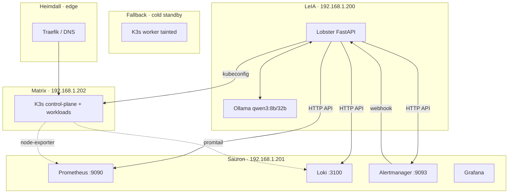

# 🖧 08 · Infraestructura — MOC

> [!abstract] El homelab SaaSphere
> SaaSphere es el homelab del autor: un clúster **K3s** con 2 nodos (matrix + fallback), monitorizado por una pila Prometheus/Loki/Grafana en Sauron, con un proxy edge en Heimdall y un host dedicado para el agente IA + GPU en LeIA.

## Notas

- [[01-SaaSphere-cluster-K3s]] — el clúster.
- [[02-Nodos-matrix-fallback]] — los dos nodos, taints, política.
- [[03-Hosts-LeIA-Sauron-Heimdall]] — hosts auxiliares.
- [[04-Ollama-GPU]] — el inferenciador local.
- [[05-RBAC-Kubeconfig]] — credenciales con privilegio mínimo.
- [[06-Systemd-deploy]] — empaquetado y arranque.

## Mapa físico

> [!info] IPs reales
> - **LeIA**: `192.168.1.200` — corre Lobster + Ollama.
> - **Sauron**: `192.168.1.201` — Prom :9090, Alertmanager :9093, Loki :3100.
> - **Matrix**: `192.168.1.202` — control plane + workloads.
> - **Fallback**: K3s worker con taint `saasphere/role=fallback:NoSchedule`.
> - **Heimdall**: borde y proxy (no es nodo del clúster).
