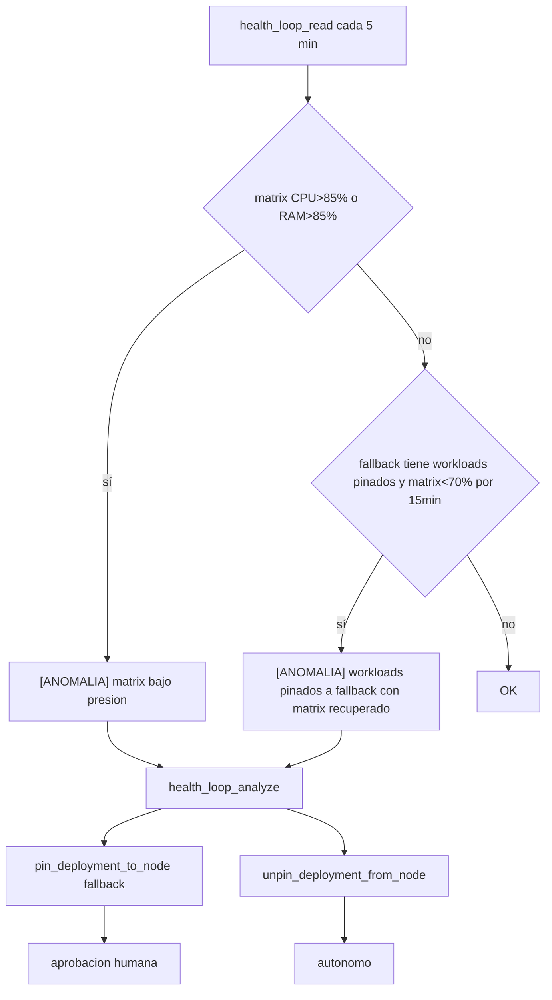

# 🧱 Nodos · matrix & fallback

> [!abstract] Dos nodos, dos roles muy distintos
> **matrix** es el host principal: control-plane + workloads de tenants. **fallback** es un cold standby tainted: solo recibe pods si se le aplica `pin_deployment_to_node`. Esta dicotomía es la base de la Fase 8 (pin/unpin).

## 🟢 `matrix` (control plane + workloads)

| Propiedad | Valor |
|---|---|
| Role | control-plane + worker |
| Hostname | `matrix` (`192.168.1.202`) |
| Taints | ninguno (programable libremente) |
| Recursos típicos | toda CPU/RAM disponible |
| Pods esperados | system pods + todos los tenants |

> [!info] Schedulable por defecto
> Sin taints, K8s programa libremente aquí. Tenants nuevos caen en matrix automáticamente.

## 🟡 `fallback` (cold standby)

| Propiedad | Valor |
|---|---|
| Role | worker |
| Taints | `saasphere/role=fallback:NoSchedule` |
| Programable sin tolerations | ❌ |
| Pods esperados | solo los pinados explícitamente |

> [!warning] No es un nodo de balanceo regular
> El system prompt insiste:
> *"Politica de fallback: el nodo fallback solo se activa cuando matrix esta saturado o caido. No es un nodo de balanceo regular. Una vez matrix recupera, devuelve los workloads con unpin."*

## 🎯 Política de uso



## 🎚️ Umbrales

```python
class SchedulerConfig:
    node_pressure_cpu_threshold_pct = 85.0          # pin: CPU > 85%
    node_pressure_memory_threshold_pct = 85.0       # pin: RAM > 85%
    node_pressure_unpin_cpu_threshold_pct = 70.0    # unpin: CPU < 70%
    node_pressure_unpin_memory_threshold_pct = 70.0 # unpin: RAM < 70%
    node_pressure_unpin_stable_minutes = 15         # ventana estable
```

## 🛡️ Reglas de seguridad

> [!danger] Si fallback también satura → NO ACTUAR
> El system prompt es explícito:
> *"Si fallback tambien esta bajo presion (segun get_node_health), notifica al operador y NO actues. Es la regla de seguridad mas importante."*
>
> Pinar a fallback en ese caso solo movería el problema.

## 🚫 Hosts que NO son nodos K3s

> [!warning] El LLM debe distinguir
> Los hosts `leia`, `sauron`, `heimdall` aparecen en Prometheus como targets (node-exporter) **pero no son nodos K3s**. El system prompt lo aclara:
> *"Los otros hosts (leia, sauron, heimdall) son targets externos de monitorizacion, NO son nodos del cluster — no intentes pinar a ellos."*
>
> Además la firma de `pin_deployment_to_node` lo bloquea con `Literal["matrix", "fallback"]`.

## ⚙️ Cómo crear el taint en fallback

> [!example] Comando manual
> ```bash
> kubectl --kubeconfig=/etc/lobster/kubeconfig taint nodes fallback saasphere/role=fallback:NoSchedule
> ```
> Esto se hace **una vez** al provisionar fallback. Lobster lo lee con `get_node_taints("fallback")` y genera las tolerations automáticamente al pinar.

## 🤖 Cómo lee Lobster los taints

```python
node = await client.get(Node, "fallback")
taints = node.spec.taints
# [{"key":"saasphere/role","value":"fallback","effect":"NoSchedule"}]
```

Y genera tolerations matching:
```python
{"key": "saasphere/role", "operator": "Equal", "value": "fallback", "effect": "NoSchedule"}
```

→ Tools de pin/unpin en [[../03-Tools/08-Mutations-Nodes]].
