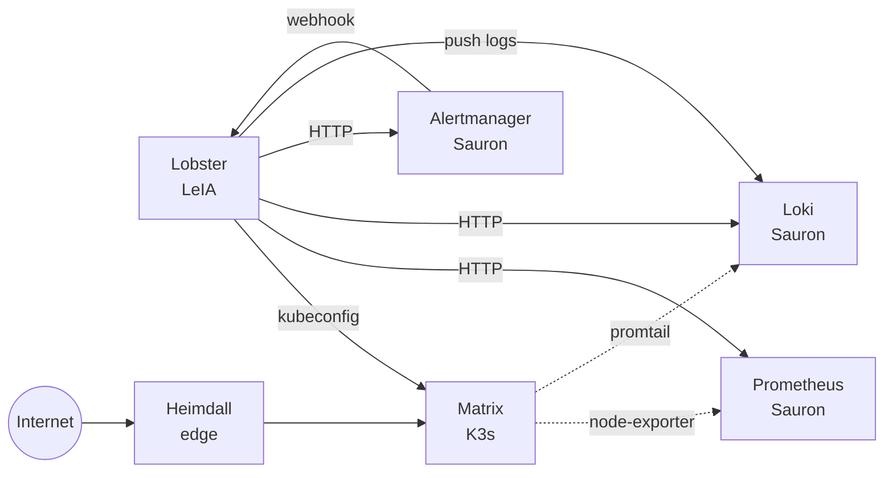

# 🧩 Hosts auxiliares

> [!abstract] Los hosts fuera del clúster
> Tres máquinas que **no son nodos K3s** pero son parte de SaaSphere: LeIA (cerebro IA), Sauron (observabilidad), Heimdall (edge).

## 🧠 LeIA · `192.168.1.200`

> [!info] El cerebro
> - Corre **Lobster** (FastAPI :8080, systemd).
> - Corre **Ollama** (:11434) con los modelos `qwen3:8b` y `qwen3:32b`.
> - Tiene **GPU** consumer (única VRAM del homelab para inferencia).
> - Aloja `/var/lib/lobster/state.db` (SQLite).
> - Aloja `/opt/lobster/obsidian/` (este vault).

> [!tip] Por qué GPU aquí
> Matrix usa CPU para tenants. La GPU no la usaría — mejor consolidarla en LeIA dedicada.

## 📊 Sauron · `192.168.1.201`

> [!info] La observabilidad
> Pila de monitorización en Docker:
> - **Prometheus** :9090 — métricas.
> - **Alertmanager** :9093 — routing y silencios.
> - **Loki** :3100 — logs.
> - **Grafana** :3000 — dashboards.

> [!tip] Por qué fuera del clúster
> Si matrix cae, Sauron sigue alertando y mostrando datos. Si Sauron cae, Lobster degrada (sus tools de lectura fallan) pero no se rompe.

### Prometheus en Sauron

```yaml
# /etc/prometheus/prometheus.yml
scrape_configs:
  - job_name: lobster
    static_configs:
      - targets: ["192.168.1.200:8080"]
  - job_name: node-exporter
    static_configs:
      - targets:
        - "192.168.1.200:9100"   # leia
        - "192.168.1.201:9100"   # sauron
        - "192.168.1.202:9100"   # matrix
        - "...:9100"              # fallback, heimdall
  - job_name: kubernetes-pods
    kubernetes_sd_configs: [...]
```

### Alertmanager en Sauron

```yaml
# /etc/alertmanager/alertmanager.yml
route:
  receiver: lobster
receivers:
  - name: lobster
    webhook_configs:
      - url: http://192.168.1.200:8080/webhook/alert
```

### Loki en Sauron

- Single binary mode.
- Push HTTP en `:3100/loki/api/v1/push`.
- Backend filesystem local.

### Grafana en Sauron

- Datasources: Prometheus + Loki.
- Dashboards provisionados desde `/var/lib/grafana/dashboards/lobster_agent/`.

## 🛡️ Heimdall · edge

> [!info] El portero
> - Traefik que reenvía hacia matrix.
> - Cert-manager / Let's Encrypt para dominios reales.
> - DNS de `*.saasphere.local`.
> - No es nodo K3s; es el reverse proxy del clúster.

> [!tip] Por qué separado
> Tener Traefik fuera del clúster permite:
> 1. Mantener TLS terminado fuera (matrix solo habla HTTP interno).
> 2. Reglas extra (rate-limit, WAF) sin meterse en K8s.
> 3. Disponibilidad: si matrix cae, Heimdall puede mostrar página de mantenimiento.

## 🔄 Roles cruzados



→ Para detalles GPU/Ollama, ver [[04-Ollama-GPU]].
