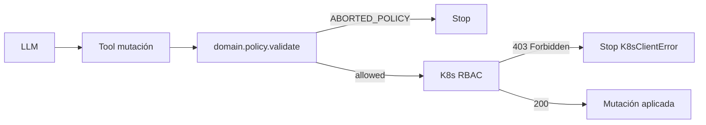

# 🔐 RBAC y kubeconfig

> [!abstract] Privilegio mínimo para el agente
> Lobster no usa el kubeconfig admin de K3s. Tiene su propio ServiceAccount con permisos limitados, generado por un script auxiliar.

## 📄 Manifest RBAC

> [!info] Ubicación
> `deploy/k8s/lobster-rbac.yaml` — define el ServiceAccount + ClusterRole + ClusterRoleBinding.

## 🚀 Aplicar

```bash
# En matrix:
kubectl apply -f deploy/k8s/lobster-rbac.yaml

# Validación previa opcional:
kubectl --dry-run=client apply -f deploy/k8s/lobster-rbac.yaml
```

## 🛠️ Generar kubeconfig

```bash
# En matrix (donde está el kubeconfig admin):
./deploy/k8s/generate-kubeconfig.sh /tmp/lobster-kubeconfig
```

## 📤 Desplegar a LeIA

```bash
scp /tmp/lobster-kubeconfig leia:/etc/lobster/kubeconfig
ssh leia "chown root:root /etc/lobster/kubeconfig && chmod 600 /etc/lobster/kubeconfig"
```

## ✅ Verificación

```bash
# Debe responder NO (verbo destructivo en namespace de sistema):
kubectl --kubeconfig=/etc/lobster/kubeconfig auth can-i delete pods -n kube-system

# Debe responder YES (lectura global):
kubectl --kubeconfig=/etc/lobster/kubeconfig get pods --all-namespaces

# Debe responder YES (patch en tenant namespace):
kubectl --kubeconfig=/etc/lobster/kubeconfig auth can-i patch deployments -n tenant-acme
```

## 🚫 Lo que el RBAC bloquea

> [!danger] Operaciones que NO se conceden
> - `delete` o `patch` en `kube-system`, `kube-public`, `metallb-system`, `saasphere-system`.
> - Acceso genérico a Secrets en sistema.
> - Crear/borrar ClusterRoles, ClusterRoleBindings.
> - Listar Nodes con write (solo read taints).

Esto se complementa con la **policy estática en el código** (`domain/policy.py`) que aplica una segunda capa de defensa en profundidad.

## ⚙️ Configuración Lobster

```python
class K8sConfig(BaseModel):
    kubeconfig_path: str = "/etc/lobster/kubeconfig"
    in_cluster: bool = False
    timeout_seconds: float = 10.0
```

> [!info] `in_cluster=False`
> Lobster corre en LeIA, FUERA del clúster. Si en el futuro se mueve dentro (como Deployment K8s), se pondría `in_cluster=True` y lightkube usaría la ServiceAccount del pod.

## 🔁 Rollback

```bash
kubectl delete -f deploy/k8s/lobster-rbac.yaml
```

## 🛡️ Doble capa de defensa



> [!tip] Por qué dos capas
> Si un día la policy del código tiene un bug, RBAC sigue protegiendo. Si el RBAC se afloja por error en una actualización, la policy del código sigue rechazando. **Belt + suspenders**.

→ Detalle de policy en [[../09-Tenants/06-Politica-namespaces]].
