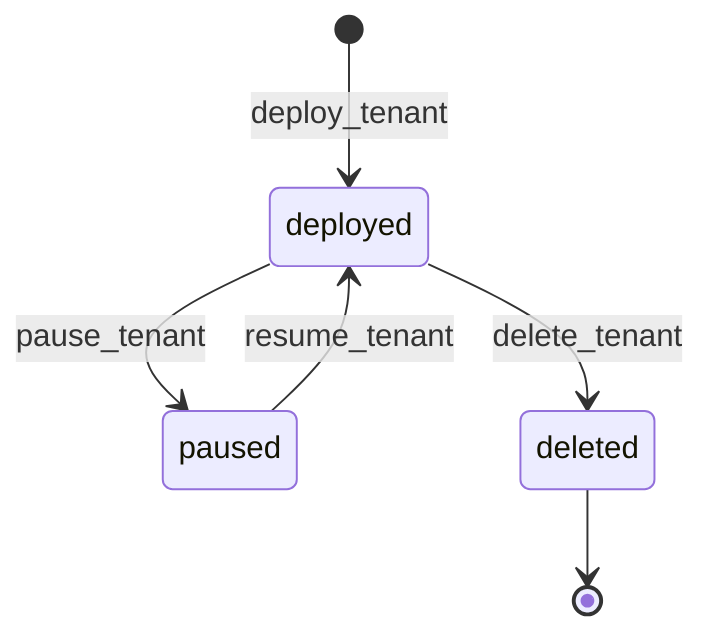

# 🏢 Modelo multi-tenant

> [!abstract] Un namespace = un tenant
> Cada cliente vive en su propio namespace Kubernetes con prefijo `tenant-`. La marca obligatoria es la label `saasphere.io/tenant=true`. Sin esa label, Lobster rechaza cualquier mutación con `aborted_policy`.

## 🏷️ Labels canónicas

```yaml
metadata:
  name: tenant-acme
  labels:
    saasphere.io/tenant: "true"        # obligatorio
    saasphere.io/tier: "free"          # free | basic | premium
    saasphere.io/type: "wordpress"     # wordpress | static_site | web_app
    saasphere.io/owner: "admin"        # quien creó el tenant
```

## 🔑 Verificación

```python
# domain/policy.py
def _is_tenant_namespace(namespace, context):
    labels = context.get("labels")
    if isinstance(labels, dict) and labels.get(TENANT_LABEL) == "true":
        return True
    namespace_labels = context.get("namespace_labels")  # {ns: {labels}}
    if isinstance(namespace_labels, dict):
        direct = namespace_labels.get(namespace)
        if isinstance(direct, dict) and direct.get(TENANT_LABEL) == "true":
            return True
    tenant_namespaces = context.get("tenant_namespaces")  # set explícito
    return isinstance(tenant_namespaces, (set, list, tuple)) and namespace in tenant_namespaces
```

> [!info] Tres caminos para "es tenant"
> 1. El manifest tiene la label.
> 2. `namespace_labels` (mapa pasado en el payload) la tiene.
> 3. Explicit allowlist `tenant_namespaces`.

## 📋 Listar tenants

```bash
uv run lobster tenants list
tenant-acme
tenant-portfolio
tenant-blog
```

Internamente:

```python
namespaces = await k8s.list_namespaces_with_label("saasphere.io/tenant=true")
```

## 🏘️ Convención de naming

> [!tip] DNS-1123 estricto
> El nombre del tenant debe ser un DNS-1123 label (regex `^[a-z0-9]([-a-z0-9]{0,61}[a-z0-9])?$`). Esto se valida en `deploy_tenant`:
> ```python
> if not DNS_1123_LABEL.match(name):
>     return "deploy_tenant failed before action creation: name must be a DNS-1123 label"
> ```
> El namespace creado será exactamente `name` (sin prefijo `tenant-` automático). Por convención el operador suele usar `tenant-acme` pero técnicamente funciona también `acme`.

## 🛡️ Aislamiento entre tenants

> [!warning] Sin NetworkPolicy automática
> Las plantillas Jinja2 actuales **no crean NetworkPolicy**. Significa que en principio un pod en `tenant-A` podría conectarse a un Service en `tenant-B`. Para un homelab personal es aceptable; para producción multi-cliente real habría que añadir:
> ```yaml
> apiVersion: networking.k8s.io/v1
> kind: NetworkPolicy
> metadata:
>   name: default-deny
>   namespace: {{ name }}
> spec:
>   podSelector: {}
>   policyTypes: [Ingress, Egress]
> ```

→ Ver [[../12-Decisiones-Limitaciones/04-Riesgos#Aislamiento entre tenants]].

## 🚦 Ciclo de vida resumido

→ Detalle en [[05-Ciclo-de-vida]].


