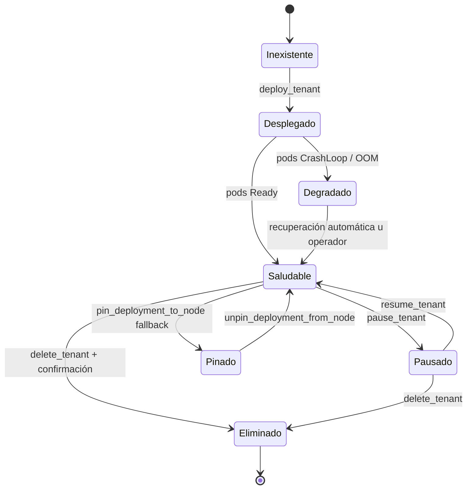

# 🔄 Ciclo de vida de un tenant

> [!abstract] De deploy a delete
> Cinco operaciones cubren todo el ciclo. Cada una está documentada en su tool correspondiente; aquí vemos el flujo end-to-end.

## 🌳 Estados posibles



## 1️⃣ Despliegue

```bash
# CLI (manual):
uv run lobster tenants deploy --type wordpress --name my-blog \
  --tier free --hostname my-blog.saasphere.local --admin-email me@example.com
```

O en Telegram:

> *"Lobster, despliégame un WordPress llamado my-blog en tier free"*

> [!info] Severidad CRITICAL
> Siempre pide aprobación humana. Tras aprobar, despliega los 9 recursos en orden de dependencia.

## 2️⃣ Verificación

```bash
uv run lobster tenants health my-blog
# ok: tenant my-blog healthy; ingresses=[{hostname: ..., address_assigned: true}]
```

O el agente lo hace solo: `verify_tenant_health(namespace)` es `AUTONOMOUS`.

> [!tip] Verificación incluye
> - Deployments con `ready_replicas == replicas`.
> - Pods sin CrashLoopBackOff.
> - PVCs `Bound`.
> - Ingresses configurados (con `address`).

## 3️⃣ Pausa (scale-to-zero)

```bash
uv run lobster tenants pause my-blog
```

Internamente:
1. Lista deployments.
2. Patchea annotations del Namespace con replicas originales.
3. Scale a 0 cada deployment.

> [!info] Recordar replicas
> Las annotations son la "memoria" — `resume_tenant` las lee para escalar de vuelta.

## 4️⃣ Resume

```bash
uv run lobster tenants resume my-blog
```

> [!info] AUTONOMOUS
> No pide aprobación. Lee las annotations `saasphere.io/paused-replicas-<deployment>` y escala cada deployment al valor original.

## 5️⃣ Migración a fallback (pin)

> [!warning] No es una operación de ciclo de vida normal
> Solo cuando matrix está saturado, Lobster decide pinar deployments concretos a fallback.
> ```python
> pin_deployment_to_node(namespace="tenant-acme",
>                        deployment_name="wordpress",
>                        node="fallback")
> ```
> Severidad NORMAL (aprobación). Auto-añade tolerations al taint del nodo.

## 6️⃣ Recuperación (unpin)

> [!info] AUTONOMOUS
> Cuando matrix se recupera (CPU < 70% y RAM < 70% durante 15 min), Lobster lanza `unpin_deployment_from_node` automáticamente. Quita el nodeSelector y las tolerations `saasphere/*` añadidas.

## 7️⃣ Borrado

```bash
uv run lobster tenants delete --namespace my-blog --confirm my-blog
```

> [!danger] Requiere confirmación textual
> `confirm` debe ser **idéntico** a `namespace`. Evita borrados accidentales.

> [!info] CRITICAL + cascade
> Borra el Namespace → cascada elimina todo (Deployment, PVCs, Secret, …). La data se pierde si no había backup externo.

## 📋 Inspección operativa

```bash
# Lista todos los tenants:
uv run lobster tenants list
# tenant-blog
# tenant-portfolio
# tenant-acme

# Detalle de uno:
uv run lobster tenants show tenant-acme
# (composite verify_tenant_health)
```

## 🤖 Decisiones automáticas

| Trigger | Acción tomada |
|---|---|
| Pod CrashLoopBackOff confirmado | `restart_pod` autónomo |
| Matrix sat. > 85% CPU/RAM | `pin_deployment_to_node` con aprobación |
| Matrix recuperado < 70% 15min | `unpin_deployment_from_node` autónomo |
| Tenant FREE sin requests 2h + previous scale-to-zero | `scale_deployment(0)` autónomo |
| Tenant FREE sin requests 2h + primera vez | `scale_deployment(0)` con aprobación CRITICAL |
| Alertmanager dispara | razonamiento + posiblemente mutación |

→ Detalles en cada nota de [[../03-Tools/00-MOC-Tools|Tools]].
