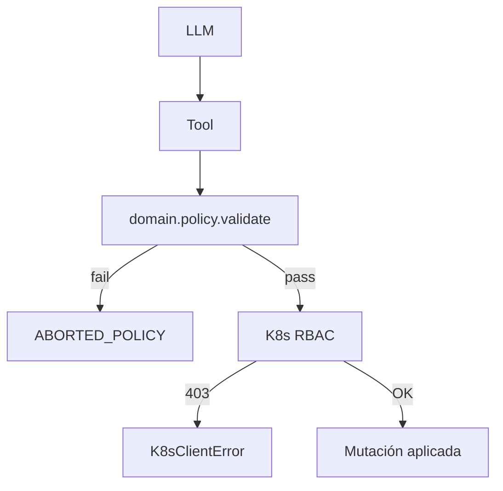

# 🛡️ Política de namespaces

> [!abstract] Lo que el agente NO puede tocar
> `lobster_agent/domain/policy.py` define la política estática. Es la primera capa de defensa (la segunda es el RBAC del kubeconfig).

## 🚫 Namespaces hard-blocked

```python
SYSTEM_NAMESPACES = {
    "kube-system",
    "kube-public",
    "metallb-system",
    "saasphere-system",
}
```

> [!danger] Ni siquiera lectura destructiva
> Cualquier `action_type` que no esté en `READ_ONLY_ACTIONS` y apunte a estos namespaces devuelve `PolicyDecision(allowed=False, severity=FORBIDDEN, reason="namespace is hard-blocked")`.

## 🚫 Recursos protegidos

```python
PROTECTED_RESOURCE_NAMES = ("traefik", "coredns", "metrics-server")
```

Si el nombre del recurso o de cualquier valor en el manifest contiene una de estas substrings → `aborted_policy`. Incluso dentro de tenant namespaces (un Deployment llamado `my-traefik` sería bloqueado).

## 🚫 Manifest kinds prohibidos

```python
FORBIDDEN_MANIFEST_KINDS = {
    "Secret",                # salvo internal_tooling=True (deploy_tenant)
    "ServiceAccount",
    "Role",
    "RoleBinding",
    "ClusterRole",
    "ClusterRoleBinding",
    "Pod",                   # no se crean pods sueltos
}
```

## ✅ Acciones read-only sin restricción

```python
READ_ONLY_ACTIONS = {
    "get_pod",
    "list_pods",
    "list_deployments",
    "list_namespaces",
    "list_recent_events",
    "query_prometheus",
    "query_loki",
}
```

> [!tip] Read-only siempre AUTONOMOUS
> No requieren tenant whitelist. Pueden leer **cualquier** namespace (incluso kube-system) porque no producen cambios.

## ✅ Política de tenant whitelist

Para mutaciones, el namespace debe ser tenant. Tres caminos:

1. **Manifest** lleva `metadata.labels.saasphere.io/tenant=true`.
2. **`namespace_labels`** en el payload (mapa `{ns: {labels}}`) tiene `saasphere.io/tenant=true`.
3. **`tenant_namespaces`** allowlist explícito (uso interno).

## 🧪 Manifests con configuraciones prohibidas

> [!danger] Anti-escape
> `policy._manifest_violations()` rechaza manifests con:
> - `privileged=true` en cualquier container.
> - `hostPath` volumes.
> - `hostNetwork=true`.
> - `hostPID=true`.
> - `hostIPC=true`.
> - Sin `resources.limits.cpu` y `resources.limits.memory` (salvo `enforce_resource_limits=False` en config).

## 📜 `PolicyDecision`

```python
@dataclass(frozen=True)
class PolicyDecision:
    allowed: bool
    severity: ActionSeverity
    reason: str
    violations: list[str]
```

Si `allowed=False`, el `MutationContext` crea la Action ya con estado `ABORTED_POLICY` y guarda `violations` en `result`.

## 🧪 Test de la policy

`tests/test_policy.py` cubre:
- Bloqueo de kube-system.
- Bloqueo de Pod kind.
- Bloqueo de hostPath, privileged.
- Permitir Secret solo con `internal_tooling=True`.
- Severidad scale_deployment a 0 (CRITICAL vs NORMAL según prior).

## 🛡️ Defensa en profundidad



> [!tip] Belt + suspenders
> El RBAC del kubeconfig también bloquea (los verbos destructivos en kube-system no están permitidos). Si la policy del código tiene un bug, el RBAC sigue protegiendo. Y viceversa.

→ RBAC en [[../08-Infraestructura/05-RBAC-Kubeconfig]].
