# ✋ Flujo de aprobación humana

> [!abstract] Lo que el operador ve y hace
> Cuando una mutación NORMAL o CRITICAL se activa, Telegram emite un mensaje con botones. El operador tiene un timeout (10 min normal / 1 h crítica) para responder. Esta nota describe la experiencia paso a paso.

## 📲 Lo que recibe el operador

> [!example] Mensaje real
> ```
> 🔔 *Solicitud de aprobación* ⚠️
>
> ⚡ *Acción:* restart_deployment
> 🏷️ *Caso de uso:* alert_reactive
> 🏠 *Tenant:* tenant-acme
>
> 📋 *Detalle:*
> ```
> {
>   "current_replicas": 2,
>   "deployment_name": "wordpress",
>   "namespace": "tenant-acme",
>   "ready_replicas": 0
> }
> ```
>
> ⏰ _Caduca: 2026-05-16T17:45:00+00:00 (8 min)_
> 🆔 `a5f23c91`
>
> [ Aprobar ] [ Rechazar ]
> [    Pausar todo    ]
> ```

## ⏱️ Timeline

```mermaid
gantt
    title Aprobación NORMAL (10 min timeout)
    dateFormat HH:mm
    section Lifecycle
    Mensaje enviado :a1, 17:30, 0min
    Operador piensa :a2, after a1, 4min
    Tap "Aprobar" :a3, after a2, 0min
    Mutación ejecuta :a4, after a3, 1min
    Notify "completed" :a5, after a4, 0min
```

```mermaid
gantt
    title Aprobación CRITICAL (1 h timeout, recordatorios cada 1 min)
    dateFormat HH:mm
    section Lifecycle
    Mensaje :a1, 17:30, 0min
    Recordatorio 1 :a2, 17:31, 0min
    Recordatorio 2 :a3, 17:32, 0min
    ... más recordatorios ... :a4, 17:32, 10min
    Tap "Rechazar" :a5, 17:45, 0min
    Notify "rejected" :a6, 17:45, 0min
```





## 🚦 Botones disponibles

| Botón | Efecto |
|---|---|
| ✅ Aprobar | `update_status(APPROVED)` → `wait_for_decision` retorna → MutationContext ejecuta |
| ❌ Rechazar | `update_status(REJECTED, "rejected_from_telegram")` → MutationContext aborta |
| ⏸️ Pausar todo | `state.set_mode(DRY_RUN, "telegram_pause_all")` → la actual sigue PENDING |

## 🛡️ Casos límite

> [!warning] El operador no responde a tiempo
> Pasa a `EXPIRED` automáticamente por `ApprovalMaintenanceLoop`. El mensaje se edita para mostrar ⌛. La mutación queda como `REJECTED` (status del approval no es APPROVED).

> [!warning] El operador toca "Pausar todo" en medio
> El modo pasa a `dry_run` pero **la aprobación actual sigue pendiente**. El operador todavía debe Aprobar o Rechazar. Si aprueba después: como ya está en dry_run, la mutación se aprueba pero `ABORTED_DRY_RUN` si `dry_run_default=True`.

> [!warning] El bot está caído
> El mensaje no se envía. La fila `Approval` queda PENDING con `telegram_chat_id=0` y `telegram_message_id=0`. Expira por timeout. La mutación se aborta. **Pero el job o el watcher quedan bloqueados en `wait_for_decision` hasta el timeout.**

## 📋 Estados visibles en `/status`

> [!example] Antes y después
> ```
> Antes:
> 🟢 Modo: normal
> 📊 Pendientes: 1
> 🔍 Última decisión: approved
>
> Después:
> 🟢 Modo: normal
> 📊 Pendientes: 0
> 🔍 Última decisión: approved
> ```

## 🛠️ Inspección

```bash
# CLI:
uv run lobster approvals show a5f23c91

# Telegram:
/show a5f23c91
```

→ Detalle de `ApprovalManager` en [[../02-Agente/06-Approval-manager]].
