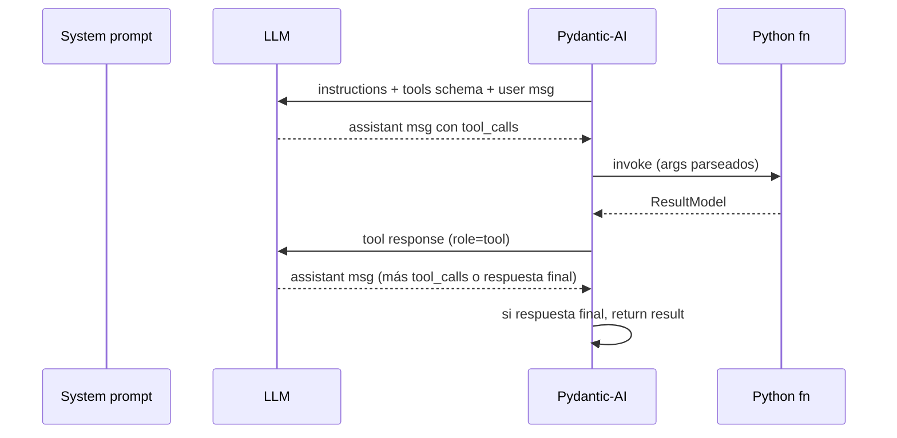

# 🛠️ Tool calling

> [!abstract] Cómo el LLM invoca código
> El LLM no llama Python directamente. Emite un JSON estructurado siguiendo el protocolo OpenAI tool_calls. Pydantic-AI lo intercepta, ejecuta la función Python registrada, y devuelve el resultado al LLM en el siguiente turno.

## 🔁 Ciclo de un tool call



## 📜 Formato del tool_call (OpenAI / Ollama)

```json
{
  "tool_calls": [
    {
      "id": "call_xyz",
      "type": "function",
      "function": {
        "name": "list_pods",
        "arguments": "{\"namespace\":\"tenant-acme\"}"
      }
    }
  ]
}
```

El `arguments` es un **string JSON**, no un dict. Pydantic-AI lo parsea contra el schema de la tool.

## 📐 Schema autogenerado

```python
async def list_pods(
    ctx: RunContext[AgentDeps],
    namespace: str | None = None,
) -> list[PodSummary] | ToolError:
    """List Kubernetes pods with phase, restarts, age, and container status."""
```

→ Pydantic-AI genera schema:

```json
{
  "name": "list_pods",
  "description": "List Kubernetes pods with phase, restarts, age, and container status.",
  "parameters": {
    "type": "object",
    "properties": {
      "namespace": { "type": "string", "nullable": true }
    },
    "required": []
  }
}
```

## 🎯 Errores como `ToolError`

```python
class ToolError(BaseModel):
    source: str
    message: str
```

> [!tip] No lanzar excepciones desde tools
> Si la tool puede fallar (timeout, recurso no encontrado), captura y devuelve `ToolError`. Eso le permite al LLM **razonar sobre el fallo** y decidir si reintentar o cambiar enfoque. Una excepción mata el run.

## 🔁 Retries automáticos

```python
Agent(..., tool_retries=1)
```

Si una tool falla (excepción no capturada), Pydantic-AI lo reintenta 1 vez. Si falla otra vez, devuelve un mensaje de error y la respuesta del agente quedará marcada como `failed`.

## 🚫 Patrón antipattern: tools como texto

> [!danger] El bug de Qwen3 con think
> Documentado en [[03-Think-mode]]. El modelo, con think activo, a veces emite:
> ```
> <tools>{"name":"restart_pod","arguments":{"namespace":"x","pod_name":"y"}}</tools>
> ```
> Eso es **texto en la respuesta**, no un tool_call real. Pydantic-AI no lo detecta y la herramienta NO se invoca.
>
> Mitigación: `use_think_mode()` desactiva think en los modos que mutan, y el system prompt incluye una prohibición explícita.

## 📊 Tracking de tools llamadas

```python
def _tools_called_from_messages(messages: Sequence[object]) -> list[str]:
    tools: list[str] = []
    for message in messages:
        parts = getattr(message, "parts", [])
        for part in parts:
            if isinstance(part, ToolCallPart) and part.tool_name not in tools:
                tools.append(part.tool_name)
    return tools
```

Se persiste en `Decision.tools_called` como JSON list. Útil para auditar "qué hizo el agente en este run".

## 🧪 Test de una tool

```python
async def test_list_pods():
    fake_k8s = FakeK8sClient(pods={"tenant-acme": [...]})
    ctx = RunContextShim(deps=AgentDeps(k8s=fake_k8s, ...))
    result = await list_pods(ctx, namespace="tenant-acme")
    assert isinstance(result, list)
    assert result[0].name == "..."
```

Sin tocar Ollama. La tool es Python normal, solo el `ctx` cambia.
