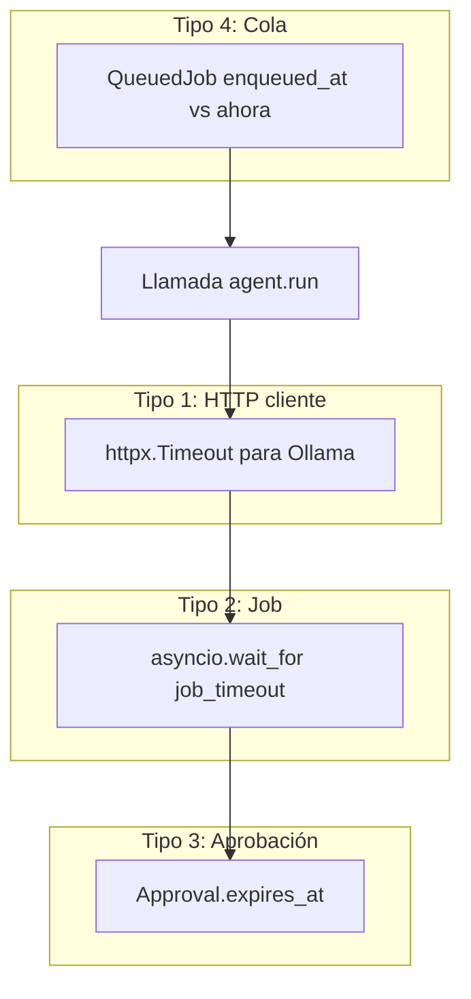

# ⏱️ Timeouts y cola FIFO

> [!abstract] Diferentes capas, diferentes ventanas
> Hay timeouts en al menos tres capas: HTTP cliente (httpx), job (asyncio.wait_for), aprobación humana. Cada uno cubre un fallo diferente. La cola FIFO (Fase 9) añade una cuarta dimensión: tiempo de espera en cola.

## 🪜 Las capas



## 🌐 Tipo 1 — HTTP cliente a Ollama

```python
# orchestrator._build_model
if think:
    timeout = httpx.Timeout(None, connect=30.0)
elif "32b" in model_name:
    timeout = max(self.settings.ollama.timeout_seconds, 900.0)
else:
    timeout = self.settings.ollama.timeout_seconds                # 180 s
```

> [!info] Lógica
> - **Think on** → sin timeout de read. Connect 30 s.
> - **32B sin think** → mínimo 900 s.
> - **8B sin think** → respeta el default (180 s).

## ⏰ Tipo 2 — Job timeout

```python
# scheduler.py
await asyncio.wait_for(self._agent.run(...), timeout=job_timeout)
```

| Job | job_timeout |
|---|---|
| `health_loop_read` | 300 s |
| `health_loop_analyze` | 900 s |
| `global_state` | 600 s |
| `hourly_summary` | 600 s |
| `daily_summary` | **1800 s** |
| `backup` | 300 s |
| `optimization` | 600 s |
| `alert_reactive` | 600 s |

> [!warning] Si timeout → métrica
> `lobster_scheduler_runs_total{outcome="timeout"}` y `lobster_errors_total{component="scheduler"}`.

## ⏳ Tipo 3 — Aprobación humana

```python
class ApprovalConfig:
    default_timeout_seconds: int = 600        # 10 min normal
    critical_timeout_seconds: int = 3600      # 1 h crítica
```

`ApprovalManager.wait_for_decision` poll cada 1 s; si `expires_at` < now → `EXPIRED`.

## 🧵 Tipo 4 — Cola FIFO (Fase 9)

> [!info] No hay timeout máximo en la cola
> Si la cola tiene 5 jobs por delante, el nuevo espera lo que tarden todos. La métrica `lobster_queue_wait_seconds` mide esto.

```python
wait_s = time.monotonic() - job.enqueued_at
lobster_queue_wait_seconds.observe(wait_s)
```

> [!warning] Política de drop
> Si la cola llena (`maxsize=20`), el nuevo job se descarta con un warning. No hay timeout, solo capacidad.

## 🚏 Composición de timeouts

> [!example] Ejemplo daily_summary
> 1. Scheduler dispara a las 08:00.
> 2. Job entra a la cola Fase 9 (puede esperar minutos).
> 3. Cuando le toca: `await asyncio.wait_for(agent.run(...), timeout=1800)`.
> 4. `agent.run` llama `Agent.run` que abre HTTP a Ollama.
> 5. La conexión HTTP usa `httpx.Timeout(connect=30, read=900)`.
> 6. El LLM hace múltiples tool_calls; cada tool_call es una nueva request HTTP.
> 7. Cada herramienta llama Prometheus/Loki/K8s con sus propios timeouts (5 s default).
> 8. Si **todo** termina antes de 1800 s, el job es exitoso.
> 9. Si **alguna** capa expira, el job falla con su outcome correspondiente.

## 🔢 Configuración

| Config | Valor | Dónde |
|---|---|---|
| `ollama.timeout_seconds` | 180 | `[ollama]` |
| `prometheus.timeout_seconds` | 5 | `[prometheus]` |
| `loki.timeout_seconds` | 5 | `[loki]` |
| `alertmanager.timeout_seconds` | 5 | `[alertmanager]` |
| `k8s.timeout_seconds` | 10 | `[k8s]` |
| `approval.default_timeout_seconds` | 600 | `[approval]` |
| `approval.critical_timeout_seconds` | 3600 | `[approval]` |

## 🧠 Decisión: timeouts conservadores en clientes

> [!tip] 5 s para Prom/Loki/AM
> Si Prometheus tarda más de 5 s en una query simple, algo está muy mal. Mejor que la tool falle rápido y el LLM razone "Prom no responde, no puedo confirmar X" que esperar 30 s y bloquear todo el ciclo.

→ Para la cola en detalle, ver [[../07-Scheduler-Watcher/07-Job-queue-fase9]].
